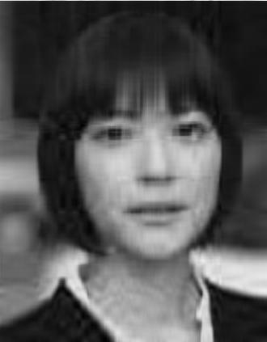
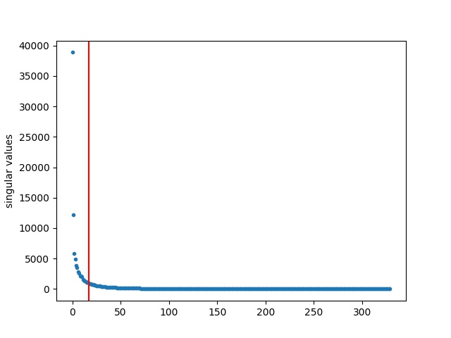

最近看到推荐系统中有涉及奇异值分解，大学里没学过奇异值（singlular value）的概念，觉得挺遗憾的。最近看了一些资料和课程，并在图像模糊处理中实践了下。

先看看效果，图1是位日本演员上野树里，图2是去掉像素矩阵中较小奇异值后的结果，可以看到图片变模糊了。本文先简要介绍奇异值理论，后介绍实践。

<div style="display: flex;">
<div style="text-align: center;flex: 50%;">

<br />
图1
</div>

<div style="text-align: center;flex: 50%;">

<br />
图2
</div>
</div>


# 1. 理论
## 1.1 定义

A是复数域中的任意矩阵，可作如下分解

$$ A=U \Sigma V^T$$

各矩阵维度如下

<!-- more -->

|  矩阵    |     行数 |   列数   |
| -------- | --------| ----- |
| A    |   m |  n  |
| U    |   m |  m  |
| $\Sigma$   |   m |  n  |
| V    |   n |  n  |
| $V^{T} $   |   n |  n  |


U和V是正交矩阵（正交矩阵M的定义：$MM^T=E$ ，即 $M^T=M^{-1}$ ），$\Sigma$的主对角线上的值称为A的奇异值，全部>=0，其他位置为0。例如

$$  \begin{pmatrix}
4 & 4\\ 
-3 & 3
\end{pmatrix} = \begin{pmatrix}
1 & 0\\ 
0 & -1
\end{pmatrix} \begin{pmatrix}
\sqrt{32} & 0\\ 
0 & \sqrt{18}
\end{pmatrix} \begin{pmatrix}
\frac{1}{\sqrt{2}} & \frac{1}{\sqrt{2}} \\ 
\frac{1}{\sqrt{2}} & -\frac{1}{\sqrt{2}} 
\end{pmatrix} 
 $$

另外下面梳理了复数域和实数域中的不同术语，它们其实是一个意思。

|  定义     |     复数域 |   实数域   |
| -------- | --------| ----- |
| 共轭转置（共轭指共轭复数）    |   $A^H$ |  $A^T$  |
|  $A^H=A$  |    Hermitian矩阵 |  对称矩阵 |
|  $AA^H=E$ |   Unitary（酉）矩阵|  正交矩阵  |

## 1.2 计算
大学里《线性代数》的特征值（eigenvalues）是重点内容，以我的理解，奇异值是特征值的高级版，两者又是相辅相成的关系。下面的等式展示了如何根据特征值计算奇异值：

$$AA^T=U \Sigma V^T V\Sigma U^T=U\Sigma^{2}U^T$$

把$AA^T$看成一个矩阵（它的性质“很好”，是复数域上的实对称阵，且半正定），这就是我们熟悉的实对称阵的对角化，并且$AA^T$与$\Sigma^2$是合同关系（congruent），这样就求得了U和$\Sigma$，同理，用轮换手法可求V。

## 1.3 几何意义
很多资料上说特征值和特征向量的意义是，把对向量v的矩阵变换A变成对该向量的缩放$\lambda$，也就是下面的式子，我一直没懂这里，感觉是为了解释而解释，并没有说明A和v的关系。

$$Av=v\lambda $$

# 2. 实践
第一次搞Python科学计算，用的是NumPy和SciPy库，程序写起来感觉和MATLAB差不多，动辄给一个矩阵或整行整列赋值，这注定运行效率较低。记录下搭建环境的方法：

```bash
wget https://bootstrap.pypa.io/get-pip.py
sudo python3 get-pip.py
sudo /usr/local/bin/pip3 install -i https://pypi.mirrors.ustc.edu.cn/simple imageio scipy numpy matplotlib
```

下面是图像模糊处理的步骤，对应后面的程序。
1. 读入图1 original.jpg（423\*330像素），得到RGB矩阵，此时矩阵是三维的（长、宽、RGB）
1. 将RGB转为灰度，减少一维，变成423\*330的二维矩阵
1. 对矩阵进行SVD分解，得到奇异值矩阵$\Sigma$
1. **取较大部分（默认top 5.4%）的奇异值，得到新的$\Sigma$矩阵**
1. 重新计算$U \Sigma V^T$得到新的灰度矩阵
1. 写入磁盘convert.jpg，即图2

其中第3步得到的奇异值矩阵是423\*330的，主对角线上有330个奇异值，如下

$$\begin{pmatrix}
 38877.46 &       &  &      & \\
       & 12187.84 &   &     & \\
  & & 5804.59&&\\
      & &       & \ddots & \\
       &    &   &        & 1.92*10^{-13} \\
\\
  & &   \Large 0   &  &
 \end{pmatrix}$$

绘制这些奇异值，如图3蓝色点所示，横坐标是序号，从0到329。可以看到数值下降得很快，在网上看到一些资料也说了这个现象，原因是什么呢？
<div style="text-align: center;">

<br />
图3 奇异值分布
</div>

第4步，取前17个（top 5.4%）奇异值，即图3中红线左边那些值，构成新的$\Sigma$矩阵。

程序如下
```python
#!/usr/bin/env python3

# original: A = U Sigma VT
# convert:  a = U sigma VT

import sys
import imageio
import numpy

import scipy.linalg
import matplotlib.pyplot as plt

def rgb2gray(rgb):
    return numpy.dot(rgb[...,:3], [0.2989, 0.5870, 0.1140])

def getReducedDim(originalDim):
    if (len(sys.argv) >= 2):
        return int(sys.argv[1])
    else:
        return int(originalDim * 0.054)

# Step 1
rgbImage = imageio.imread('original.jpg') # 3D array
print('rgbImage is\n', rgbImage)

# Step 2
A = rgb2gray(rgbImage) # grayscale image, 2D array
print('A is\n', A)

# Step 3
U, S, VT = scipy.linalg.svd(A)
print('S is\n', S)
plt.plot(S, '.')
plt.ylabel('singular values')

# Step 4
reservedNum = getReducedDim(len(S))
s = S[0 : reservedNum]
plt.axvline(x=reservedNum, color='r')
print('reservedNum is', reservedNum)
print('s is\n', s)

print(A.shape, U.shape, S.shape, VT.shape, s.shape)

# convert vector s to matrix sigma
sigma = numpy.zeros((A.shape[0], A.shape[1]))
minDim = len(s)
sigma[:minDim, :minDim] = numpy.diag(s)

# Step 5
a = U.dot(sigma.dot(VT))
print('a is\n', a)

# Step 6
imageio.imwrite('convert.jpg', a)
plt.savefig('sv.jpg')
```

说实话，这是我第一次真实感受到数学的威力，矩阵特征值的概念最早可追溯到欧拉那时，我疑惑的是，他们是怎么抽象出这种概念的，以至于可运用在现代的图像处理、推荐系统中。我们平常做一个系统，也想着抽象，希望将来仍能使用，但没有达到数学那种极致的抽象以至能复用几百、几千年。我一直疑惑的另外一个概念是行列式，课本上说了它的意义是向量构成的长方形或立方体的体积，但实践中它有哪些意义？基本上每本教材第一章就介绍这个概念，定义很复杂，第一个提出这个概念的人怎么就能想到呢？我见过国外一本线性代数教材 Linear Algebra Done Right 就很有特色，把**行列式放到最后一章讲**，用特征多项式引出行列式的概念（特征值之积等于行列式）。

最后的疑问，去掉较小奇异值后，图像模糊了，为什么能够保持图像的轮廓？我理解轮廓是通过像素间的对比度展现的，它们与奇异值到底是什么关系？

<br />
### 参考资料
- Python绘图库Matplotlib，功能全面，绘图上基本可以取代MATLAB了 <https://matplotlib.org/tutorials/introductory/pyplot.html>
- 使用MathJax在网页中支持$\LaTeX$ <http://docs.mathjax.org/en/latest/tex.html#>
- 在线$\LaTeX$编辑器 <https://www.codecogs.com/latex/eqneditor.php>
- 本文的实践例子来自文章[《一文让你通俗理解奇异值分解》](https://mp.weixin.qq.com/s?srcid=&scene=22&mid=2652567516&sn=7239d6d651fe77e996402c191fa68ad2&idx=1&__biz=MzA5ODUxOTA5Mg%3D%3D&chksm=8b7e0687bc098f919deb57b6113339467bd1abe42cb53f7db5909a90d6d4cb22291bc983c903&mpshare=1&pass_ticket=FgjWLmf8ibCcxLKl%2B8dwMM0ex6Q8wlLp7b1aeDiVg9vc0EcMBfq%2FrVGy66oK%2B8ga#rd)
