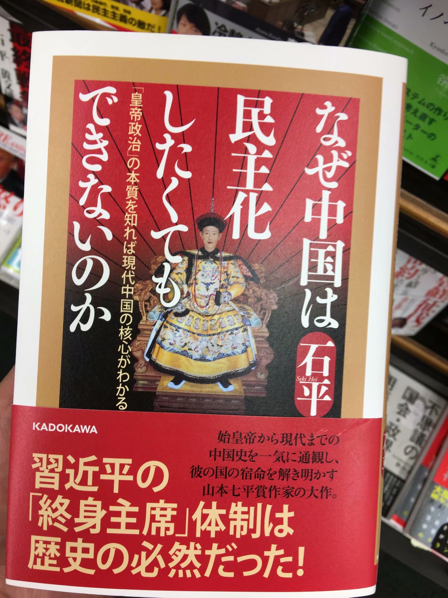

去日本游玩虽然过去两年了，时常回想起那儿的场景历历在目，仿佛发生在昨天。日本是个很有特色的国家，比如垃圾处理、XX、高度统一的衣着、别致的装修，很值得一去。

2018年5月26日下午和同事从深圳蛇口码头出发去香港机场，到日本凌晨3点，日本比中国早一个小时，在关西机场（大阪西边的一个岛上）的罗森店里买了个饭团填饱肚子，惊喜的是，看到了熟悉的“推荐使用支付宝”。在日本支付宝比微信支付普遍多了，可能是因为阿里有个软银爸爸在这吧，对了，在这边手机上网显示的电讯供应商就是“softbank”。在机场还看到了24小时的“中文”咨询台，可见来日本的中国游客多么多。

终于等到5点半，我们坐上了第一班去京都的地铁，这边叫JR(Japan Railway)线，与国内不同的是，日本是不分地铁与高铁的，轨道线从南到北贯穿日本，到城市里的话就入地下。经过这几天的见闻，给我的感觉是日本对自己的铁道历史和技术相当自豪，在大阪书店里看到好几排的铁道书籍、杂志、碟片，还有很多周边，比如著名的铁胆火车侠动画片，做成mini火车的筷子，印有火车侠的衣服等等，在京都还有专门的铁道博物馆。

大概7点半到京都，我们立刻去找早餐店，在街边找了半天也没找到合适的，京都街边的餐馆很少，后来才发现很多餐馆都在地下，最终我们还是在711买的早饭。这家711呢，有三个收银台，只有中间会<!-- more -->排一列队，队头的人看哪个收银台空闲就上去，地上的指示很清楚，这样的排队更有秩序，也更公平。说到这里，想起香港的公交站排队比内地有秩序多了，很重要的一点是，引导人们排队的指示做得不错，地上的划线明确。

 
711店内排队

另一个特色是，711店内的货架上赫然摆放着成人杂志、碟片公开出售，收银员和顾客也不会觉得害羞，他们卖XX碟片就像国内便利店卖避孕套一样普遍，只能说是文化观念不同，国内文革那时哪还敢公开卖避孕套呢，随着社会的发展，人们的观念也更加开放了，再想想中东一些国家女性还不允许露脸之外的部位呢。

那家店没有座位，我们去了附近的梅小路公园吃早饭，周日的早晨很多家庭在公园里打棒球，怡然自得。恰巧碰到个学生组织的音乐会，走过去瞧瞧，路上恰巧碰到这段猴子表演杂技，难以想象猴子是怎么被训练成这样的。

<iframe height="700" width="395" src="https://player.youku.com/embed/XNDc1MDM1MzUyNA==" frameborder="0" allowfullscreen></iframe>
 
猴子杂技

吃完早饭后，我一边提着垃圾袋一边找垃圾桶，令我吃惊的是，走遍了整个公园都没发现垃圾桶，看到有学生在公园做地震宣传活动，日本是个多地震国家，上去问他哪有垃圾桶，被告知这附近都没有，后来才知道，日本街道上是没有垃圾桶的，好像很久以前一个邪教组织在东京火车站的垃圾桶里投了毒气弹，造成很多人死亡，所以日本政府就在公开场合把垃圾桶撤掉了。

 
地震宣传活动

到下午3点，我们可以去住处了，在Airbnb上订的民宿，关于日本的垃圾处理是出了名的，对垃圾的分类到了极致，好像是周几扔特定种类的垃圾，我们租的民宿的告示上让我们把垃圾放在家里让房东处理，绝对不要把垃圾丢在家外面，查了下日本的习惯，通常不在外面吃东西，如果一定要的话自己得带个垃圾袋，然后垃圾带回家。

一进屋就被这温馨的环境吸引了，怎么可以装修得这么舒心而质朴，当天晚上我就把这屋子的装修研究了个遍，洗澡间地势比外面矮大概15厘米，为防滑全铺的是软垫子，洗手间和餐厅地板看着是木质，其实是很厚的软胶皮，客厅和卧室地上铺草席，好像日本大多数家庭都会铺。

 
“餐厅”

 
“客厅”

 
榻榻米

<iframe height="700" width="395" src="https://player.youku.com/embed/XNDc1MDM3MDI0OA==" frameborder="0" allowfullscreen></iframe>
 
京都的民宿

屋里装饰了很多日本名画，是江户时代浮世绘作品，比如下面这幅《神奈川冲浪里》在国内就经常见到。

 
神奈川冲浪里

 
东海道五十三次-朝之富士

 
第三代大谷鬼次之奴江户兵卫 & 妇女人相十品

 
熊本熊

早上去711店里买早饭和洗衣液，沟通的话就说英文，不会的就用谷歌翻译成日文给他们看。另外出国建议装个谷歌地图很实用。回来路上碰到幼儿园老师推着孩子们去上学 : ) 关于日本教育可以看看周轶君的《他乡的童年》日本篇。

 
幼儿园老师带着孩子们上学

京都虽然节奏慢，但这里有世界一流的京都大学，我到京都最大的书店Maruzen（丸善书店）看了一个下午的书，我觉得书店是一个社会的缩影，包罗万象，很能反映一个国家的方方面面。为了对日本的美好回忆更长久，我买了两本书作为纪念。一本是我本行的书Ruby（两百多人民币），它是日本计算机科学家松本行弘发明的一门风靡世界的编程语言，我在研究生时接触并喜欢的，它的API设计得精悍简洁，挺有日本的风格: ) 另外一本书是日本史，想看看日本人怎么说七七事变、南京大屠杀的，有的历史听一面之词可能会片面。书店里还有一些讲中国政治的禁书。日本书的特点是做工精致，书的封皮、纸张厚。

 
带回国的书：Ruby和日本史

 
中国政治

 
改宪

 
人工智能

 
给小学生看的Ruby

在书店还看到了日本的公务员考试书，考试内容和国内的差不多，要上知天文、下知地理，下面是生物科，要考到减数分裂，难度似乎比国内更高。

 
公务员考试用书

 
平成29年（2017年）各县市的公务员报考情况

在日本吃饭一顿大概七、八百日元（约五十人民币），那里不管买什么都标有两个价格：商品本身价格和消费税（税率8%）。日本的纸币封面人物也很有特点，全是文化人，比如1000日元的生物学家野口英世，5000日元的小说家樋口一叶，1万日元的启蒙思想家福泽谕吉。

 
生物学家野口英世

第二天，我们去了伏见稻荷神社⛩，见到很多学生来求学拜佛，还有很多穿和服的小姐姐，听说基本是中国人穿着来拍照的[捂脸]，因为日本人在节日才穿和服。在日本的这几天，观察到日本人的衣着惊人地统一，男性学生和上班族，清一色的白衬衫加西裤，女学生则是白衬衫加裙子，日本人习惯用黑白色，地铁站的指引牌、横幅都是白加黑，放在国内还以为死人了呢。日本人用的雨伞据我看到的八成都是长柄透明塑料伞，我特意查了原因，都被称为“国民用伞”了 [《日本雨伞的那些事》](https://www.sohu.com/a/272382045_100207483)

 
求学拜佛的学生

 
游人们的许愿

 
求学签

 
白加黑的条幅（龙谷大学）

第三天我们去了岚山，来这里游玩的人很多，看着很多都是中国人，真是去哪都是中国人啊，这边有几座寺庙，来到岚山竹林，这里的大轮人力车是一道别致的风景，之后爬到山腰准备做小火车往回。

 
于岚山嵯峨野

京都的旅行就结束啦，现在来到大阪，顺便说一下，京都、大阪、奈良离得很近，很多人来这边都是连着玩，不过我们这次没去奈良，听说奈良的鹿很出名。大阪的商业气息明显比京都浓多了，高楼林立，从民宿价格也可以看出，京都的民宿平均每人每晚200人民币，大阪大概是京都两倍。来大阪这边就是买买买，很多药妆店，各种膏药、化妆品等等小东西应有尽有，甚至有的药妆店把中国人最爱买的那几样像地摊货一样准备好堆在店门口了，想想挺讽刺的。

在商场里看到很多相框等手工艺品是柬埔寨、越南等经济不发达的国家制造，这时再看到中国制造，真的不觉得有什么自豪，反而觉得羞耻，不知道从“中国制造”到“中国创造”还有多长的路。有意思的是，商场里碰到个占卜店如此地堂皇，这大都市信奉占卜的人看来不少，或许是文化的不同。

 
大阪的占卜店

最后一天吃完午饭我们就踏上了归途，至此日本之旅就结束了，回到香港已经晚上10点，然后包个车回深圳。有机会还会去日本玩的！

 
关西机场回程

