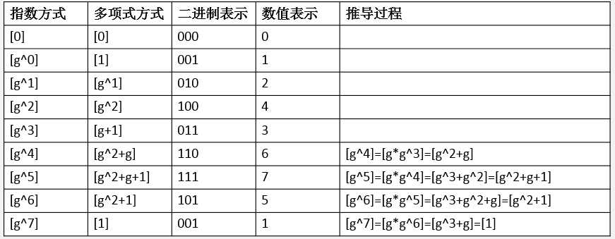

2021年6月重新整理后在部门做的分享 <a target="_blank" href="https://mp.weixin.qq.com/s/4dFdz0H0mjpemDflKbTdmQ">https://mp.weixin.qq.com/s/4dFdz0H0mjpemDflKbTdmQ</a>

=============

FEC名为前向纠错（Forward Error Correction），用于恢复丢失的信息。看了很多介绍FEC的文章把矩阵和伽罗瓦域混在一块讲，大大提升了理解的难度。其实两者可以独立看待，我明白后有一种醍醐灌顶的感觉，**伽罗瓦域（又名有限域）理论是连接连续数学和计算机落地实现时的桥梁**，后文会详细说明。

本文分三部分介绍。
1. 第一部分背景介绍，面向所有人，尽量讲解得通俗易懂，希望读者至少能看懂本文要解决什么问题。
1. 第二部分面向学过高数的同学，讲解FEC怎么解方程来恢复数据的。
1. 第三部分面向数学、计算机专业等学过群论的同学，讲解FEC在用计算机解方程时碰到的问题及如何用群论优美地解决的。

 

# 1. 背景介绍
大家用过微信的视频通话，有时网络不佳会感觉卡顿，视频是由“一幅幅图像”组成的（真实情况更复杂，这里为了降低理解的门槛简化说明），如果某一幅图像在传输过程中丢失接收者可能感觉卡顿。

 
微信通话

<!-- more -->
画幅图说明，发送端发了3个数据包，不加任何处理，经过网络传输丢失其中一个数据包，接收端只收到两个，就可能引起卡顿。

 
裸数据传输

如果在发送前根据3个数据包的特点，计算出一个FEC包，当3个包任意一个丢失，可以通过FEC包和剩余的两个计算出丢失的包。

 
加冗余数据FEC传输

可能有读者觉得这没什么了不起的，多传了数据，当然能恢复了，你可以把那3个包发两遍甚至多遍，总能保证都送达。你多发了几倍的数据很浪费，有没有办法尽可能少得发冗余包并达到相同的效果？下面将介绍怎么计算冗余包，并讲解如何恢复数据。

 

# 2. 计算冗余及数据恢复

待传输的数据是$\mathbf{d}$，通过范德蒙矩阵V生成冗余数据$\mathbf{r}$，将它们发送出去，接收端收到数据可能丢失了其中一部分，下面看如何恢复。

发送端编码如下

$$
\begin{pmatrix}
E \\
V
 \end{pmatrix}
\mathbf{d} =\begin{pmatrix}
\mathbf{d} \\
\mathbf{r}
 \end{pmatrix}
$$

例如

$$
\begin{pmatrix}
1& & \\
& 1& \\
& &1 \\
1& 1& 1\\
1& 2& 3
 \end{pmatrix}
\begin{pmatrix}
d_1 \\
d_2 \\
d_3
 \end{pmatrix}
=
\begin{pmatrix}
d_1 \\
d_2 \\
d_3\\
r_1\\
r_2
 \end{pmatrix}
$$

其中$d_2$在传输过程中丢失了，剩余的$d_1$, $d_3$, $r_1$, $r_2$成功到达目的地，现在问题是如何根据剩余的数据计算回$d_2$？发送前我们准备了两个冗余数据$r_1$和$r_2$，其实允许丢两个数据，现在只丢了一个，所以多一个冗余数据，我们去掉$r_2$，删除V中相应行；$d_2$丢失了，也删除E中相应行。总结说，加了几个冗余数据，总共就删几行，最终使之变为方阵，用于后续计算。由于范德蒙矩阵良好的性质，删除行后的方阵是可逆的，这样就求出了$\mathbf{d}$。

$$
\begin{pmatrix}
1& & \\
& &1 \\
1& 1& 1\\
 \end{pmatrix}
\begin{pmatrix}
d_1 \\
d_2 \\
d_3
 \end{pmatrix}
=
\begin{pmatrix}
d_1 \\
d_3\\
r_1\\
 \end{pmatrix}

\\
\Rightarrow

\begin{pmatrix}
d_1 \\
d_2 \\
d_3
 \end{pmatrix}
=
\begin{pmatrix}
1& & \\
& &1 \\
1& 1& 1\\
 \end{pmatrix}^{-1}
\begin{pmatrix}
d_1 \\
d_3\\
r_1\\
 \end{pmatrix}

$$

### 高斯消元法
当然也可以用高斯消元法求解方程组，本质上还是矩阵求逆，这里顺便总结一下。

求$A \mathbf{x} = \mathbf{y} $，把方程写成augmented matrix形式，经过行初等变换化为上三角矩阵，再back substitution就把$\mathbf{y}$化成了解。而一系列的行初等变换等价于左乘一系列初等变换矩阵，合起来就是A，即如下形式，最终解是$A^{-1}\mathbf{y}$，与上面结果一致。

$$

\begin{pmatrix}
A & \mathbf{y}
 \end{pmatrix}
=
A
\begin{pmatrix}
E & A^{-1}\mathbf{y}
 \end{pmatrix}

$$

最后再说下，高斯消元法、矩阵求逆、矩阵乘法的普通算法时间复杂度都是$O(n^{3})$，截止本文时间（2020年8月17日），最好的算法是2014年发明的Coppersmith–Winograd algorithm，时间复杂度是$O(n^{2.3728639})$。

 
# 3. 在计算机上落地实现
第二部分介绍的矩阵运算要在计算机上落地实现，会碰到什么问题？**运算是在实数域上进行的，加减乘除可能会溢出，浮点数的计算可能损失精度**，而离散数学中的群论可以解决这些问题。伽罗瓦域是一门通用的技术，并不是FEC特有的。

 
离散数学的重要性

我不打算介绍群环域那些加法交换律、乘法分配律balabala的定义，要补充这方面的知识推荐看下《密码编码学与网络安全》中的有限域一章，上面把某些概念引入的背景说得很清楚，我就直接说说应用和结论。

假设编程语言中有一种数据类型是uint2_t，即2比特位，它可以表示 $2^2$ 种状态(00, 01, 10, 11)。如果是普通意义上的四则运算，比如2\*3=6会溢出，1/3也无法用uint2_t表示，而有限域上的“加减乘除”没这些问题，运算结果仍然在该域上，用鹅厂一句时髦的话说，是“闭环”的。

在galois field GF($p^n$)={0, 1, ..., $p^n$-1}上满足三种多项式运算

1. 使用代数基本规则的普通多项式运算
1. 系数运算是模p运算的多项式运算，即系数在GF(p)={0, 1, ..., p-1}中
1. 系数在GF(p)中，且多项式被定义为模一个n次多项式primitive polynomial m(x) 的多项式运算。primitive polynomial可以理解为多项式的“素数”。

| 次数n   | 最简primitive polynomial (二进制表示) |
| :--:  | --: |
| 1 |              11 |
| **2** |             **111** |
| **3** |           **1011** |
| 4 |           1,0011 |
| 5 |          10,0101 |
| 6 |         100,0011 |
| 7 |        1000,1001 |
| **8** |       **1,0001,1101** |
| 9 |      10,0001,0001 |
| 10|     100,0000,1001 |

GF($2^n$)的最简primitive polynomial

设g是primitive polynomial的根，即m(g)=0，不用算出它的值，称g为有限域的generator。     

<!--

-->
举个栗子，GF($2^2$)上每个元素对应一个多项式

|元素（十进制）| 二进制   | 对应的多项式 | generator表示|
| :--:| :--:  | :--: |:--: |
|0| 00 |              0 |0|
|1| 01 |             1 | $g^0$|
|2| 10 |            x |$g^1$|
|3| 11 |            x+1 |$g^2$|

计算2+3，注意系数模2，即异或运算

$$ 2+3 = x+(x+1) = 2x+1 =1   $$

计算2\*3，注意中间得到$x^2+x$即6溢出了，要模primitive polynomial 111 即 $x^2+x+1$

$$ 2*3 = x*(x+1) = x^2+x = (x^2+x) \% (x^2+x+1) = 1 $$

减法由加法逆元推导出，除法由乘法逆元推导出，不再举例，所有的计算结果见附录2。

### 扩展为GF($2^3$)
GF($2^2$)上的generator表示元素的好处不太明显，举个更多元素的例子GF($2^3$)。primitive polynomial是1011（即$x^3+x+1$），满足$g^3+g+1=0$。

注意上面“指数方式”和“数值表示”两列，例如$g^5=7$，即$\log_{g} 7=5$，把所有都写成指数与对数的表格形式：

|元素i| 0   | 1 | 2 | 3|4| 5|6|7|
| :--:| :--:  | :--: |:--: |:--: |:--: |:--: |:--: |:--: |
| $g^i$|1| 2|4|3|6|7|5|1(开始循环)|
| $\log_{g} i$|无| 0|1|3|2|6|4|5|

我们在计算两个元素的乘法时可以用指数形式相加，例如

$$ 3*7=g^{\log_{g} 3} * g^{\log_{g} 7} = g^3*g^5 = g^8 = g^{8 \% 7} = g^1=2  $$

同理，重新计算GF($2^2$)上的2\*3:

$$ 2*3=g^{\log_{g} 2} * g^{\log_{g} 3} = g^1*g^2 = g^3 = g^{3 \% 3} = g^0=1  $$

除法用指数相减，不再举例，这样就大大简化了乘法和除法的运算。至于为什么元素都可以表示成generator的幂，可以看下前面说的教材，这也就是为什么称之为generator。

### 扩展为GF($2^8$)
计算机中一个字节是8位，可以用uint8_t表示，计算时就可以用GF($2^8$)，规则与上述类似，这样加减乘除的结果都可以用一个字节表示，原本浮点数的乘除法很耗CPU，但用generator表格法将乘除转化为加减，就大大提升了性能。

有限域不仅仅用于音视频通信中，还广泛应用于磁盘冗余存储、加密通信等领域，它们都是计算机方面的应用，本质都是因为计算机里只有0和1，是离散的。这是我第一次认识到离散数学在计算机中的重要性，大学时学习近世代数感觉很抽象，可能很多同学都有过这样的疑惑“不知道学了有什么用”，但是说不定你将来什么时候就会用到！如果老师在上课时能引入一些实际例子就好了，这样能提升大家的兴趣。在写作本文查阅资料时，我发现读研时有个老师上密码学会讲有限域，现在想想挺后悔没选那门课，工作之后越发觉得应该在大学时系统学习下密码学，现在工作时用到再去查知识就很零散。

 

*参考资料*
1. 香农信息论纪录片 https://v.qq.com/x/page/a0197khdkeg.html
1. 微信视频通话技术分享 by cicelygu(谷沉沉) https://www.sohu.com/a/214741523_355140
1. 《谈谈有限域那些事儿》我看过的有限域文章中思路最清楚的 https://blog.csdn.net/qmickecs/article/details/77281602
1. 《离散对数和椭圆曲线加密原理》和上一篇是同一作者写的，讲了有限域在加密中的应用 https://blog.csdn.net/qmickecs/article/details/76585303
1. 目前最优的矩阵乘法算法（2014年发明） https://en.wikipedia.org/wiki/Coppersmith%E2%80%93Winograd_algorithm
1. 冯克勤《有限域》，是《走向数学丛书》中的一本，这套丛书面向高中数学水平，讲解深入浅出。
1. 中科大苗付友&黄文超老师的《现代密码学理论与实践》有限域课件 http://staff.ustc.edu.cn/~huangwc/crypto/4.pdf
1. William Stallings 《密码编码学与网络安全：原理与实践》 Cryptography and Network Security: Principles and Practice
1. FEC技术浅析 http://km.oa.com/group/23275/articles/show/336495

 
 

附1：GF(p)在有限域上的四则运算，由普通算术与**模素数**定义，第一列加减乘除第一行。

| +   | 0 | 1 | 2|
| :--:  | :--: |:--:|:--:|
|**0**| 0 | 1 | 2|
|**1**| 1 | 2 | 0|
|**2**| 2 | 0 | 1|

加

| -   | 0 | 1 | 2|
| :--:  | :--: |:--:|:--:|
|**0**| 0 | 2 | 1|
|**1**| 1 | 0 | 2|
|**2**| 2 | 1 | 0|

减

| *   | 0 | 1 | 2|
| :--:  | :--: |:--:|:--:|
|**0**| 0 | 0 | 0|
|**1**| 0 | 1 | 2|
|**2**| 0 | 2 | 1|

乘

| /   | 0 | 1 | 2|
| :--:  | :--: |:--:|:--:|
|**0**| 无 | 0 | 0|
|**1**| 无 | 1 | 2|
|**2**| 无 | 2 | 1|

除

 
附2：GF($p^n$)在有限域上的四则运算，由**多项式算术**定义，第一列加减乘除第一行。

| +   | 0 | 1 | 2| 3|
| :--:  | :--: |:--:|:--:|:--:|
|**0**| 0 | 1 | 2| 3|
|**1**| 1 | 0 | 3| 2|
|**2**| 2 | 3 | 0| 1|
|**3**| 3 | 2 | 1| 0|

加

|  -  | 0 | 1 | 2| 3|
| :--:  | :--: |:--:|:--:|:--:|
|**0**| 0 | 1 | 2| 3|
|**1**| 1 | 0 | 3| 2|
|**2**| 2 | 3 | 0| 1|
|**3**| 3 | 2 | 1| 0|

减

|  *  | 0 | 1 | 2| 3|
| :--:  | :--: |:--:|:--:|:--:|
|**0**| 0 | 0 | 0| 0|
|**1**| 0 | 1 | 2| 3|
|**2**| 0 | 2 | 3| 1|
|**3**| 0 | 3 | 1| 2|

乘

|  /  | 0 | 1 | 2| 3|
| :--:  | :--: |:--:|:--:|:--:|
|**0**|无 | 0 | 0| 0|
|**1**|无 | 1 | 3| 2|
|**2**|无 | 2 | 1| 3|
|**3**|无 | 3 | 2| 1|

除

(End)
