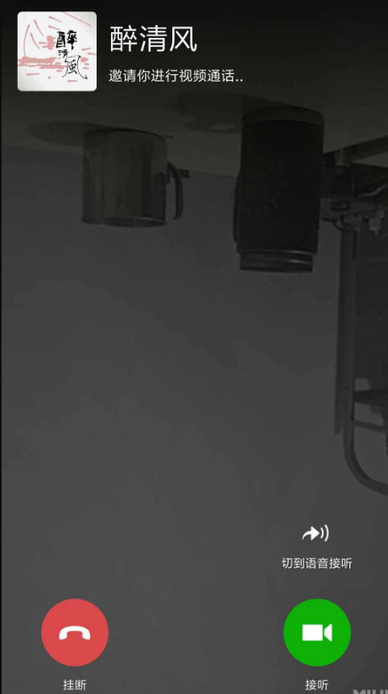
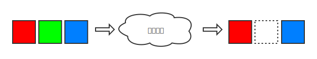
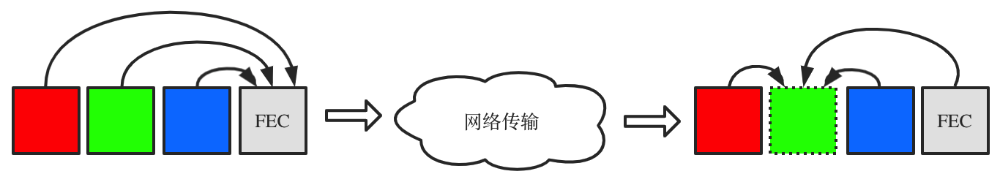
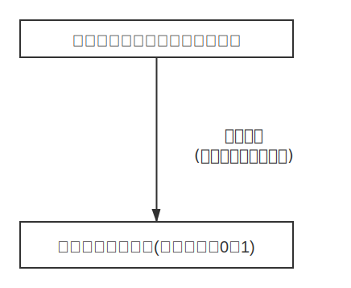

FEC名为前向纠错（Forward Error Correction），用于恢复丢失的信息。看了很多介绍FEC的文章把矩阵和伽罗瓦域混在一块讲，大大提升了理解的难度。我看懂之后有一种醍醐灌顶的感觉，以我的理解，两者可以独立看待！**伽罗瓦域（即有限域）理论是连接连续数学和计算机落地实现时的桥梁**，后文会详细说明。

本文分三部分介绍。
1. 第一部分背景介绍面向所有人，尽量讲解得通俗易懂，希望读者至少能看懂本文要解决什么问题。记得有位物理学家说过把一个理论给你的仆人讲明白了，就说明你真正懂了。
1. 第二部分面向学过高数的同学，讲解FEC怎么解方程（即矩阵运算）做错误恢复的。
1. 第三部分面向数学、计算机专业等学过群论的同学，讲解FEC在用计算机进行矩阵运算时碰到的问题及如何用群论优美地解决的。

<!-- more -->

## 1. 背景介绍
大家用过微信的视频通话，有时网络不佳会感觉卡顿，视频是由“一幅幅图像”组成的（真实情况更复杂，这里为了降低理解的门槛简化说明），如果某一幅图像在传输过程中丢失接收者可能感觉卡顿。

 
微信通话

画幅简图说明，发送端发了3个数据包，不加任何处理，经过网络传输丢失其中一个数据包，接收端只收到两个，就可能引起卡顿。

 
裸数据传输

如果在发送前根据3个数据包的特点，计算出一个FEC包，当3个包任意一个丢失，可以通过FEC包和剩余的两个计算出丢失的包。

 
加冗余数据传输

可能有读者觉得这没什么了不起的，多传了数据，当然能恢复了，你可以把那3个包发两遍甚至多遍，总能保证都送达。你多发了几倍的数据很浪费，有没有办法尽可能少的发冗余包并达到相同的效果？下面将介绍怎么计算冗余包最划算，并讲解如何恢复数据。

## 2. 计算冗余包及恢复丢失数据

待传输的数据是$\mathbf{d}$，通过范德蒙矩阵V生成冗余数据$\mathbf{r}$，将它们发送出去，接收端收到数据可能丢失了其中一部分，下面看如何恢复。

发送端编码如下

$$
\begin{pmatrix}
E \\
V
 \end{pmatrix}
\mathbf{d} =\begin{pmatrix}
\mathbf{d} \\
\mathbf{r}
 \end{pmatrix}
$$

例如

$$
\begin{pmatrix}
1& & \\
& 1& \\
& &1 \\
1& 1& 1\\
1& 2& 3
 \end{pmatrix}
\begin{pmatrix}
d_1 \\
d_2 \\
d_3
 \end{pmatrix}
=
\begin{pmatrix}
d_1 \\
d_2 \\
d_3\\
r_1\\
r_2
 \end{pmatrix}
$$

其中$d_2$在传输过程中丢失了，剩余的$d_1$, $d_3$, $r_1$, $r_2$成功到达目的地，现在问题是如何根据剩余的数据计算回$d_2$？发送前我们准备了两个冗余数据$r_1$和$r_2$，其实允许丢两个数据，现在只丢了一个，所以多一个冗余数据，我们去掉$r_2$，删除V中相应行；$d_2$丢失了，也删除E中相应行。总结说，加了几个冗余数据，总共就删几行，最终使之变为方阵，便于后续计算。由于范德蒙矩阵良好的性质，删除行后的方阵是可逆的，这样就求出了$\mathbf{d}$。

$$
\begin{pmatrix}
1& & \\
& &1 \\
1& 1& 1\\
 \end{pmatrix}
\begin{pmatrix}
d_1 \\
d_2 \\
d_3
 \end{pmatrix}
=
\begin{pmatrix}
d_1 \\
d_3\\
r_1\\
 \end{pmatrix}

\\
\Rightarrow

\begin{pmatrix}
d_1 \\
d_2 \\
d_3
 \end{pmatrix}
=
\begin{pmatrix}
1& & \\
& &1 \\
1& 1& 1\\
 \end{pmatrix}^{-1}
\begin{pmatrix}
d_1 \\
d_3\\
r_1\\
 \end{pmatrix}

$$

当然也可以用高斯消元法求解方程组，本质上还是矩阵求逆，这里顺便总结一下。求$A \mathbf{x} = \mathbf{y} $，把方程写成augmented matrix形式，经过行初等变换化为上三角矩阵，再back substitution就把$\mathbf{y}$化成了解。而一系列的行初等变换等价于左乘初等变换矩阵，即如下形式，最终解是$A^{-1}\mathbf{y}$，与上面结果一致。

$$

\begin{pmatrix}
A & \mathbf{y}
 \end{pmatrix}
=
A
\begin{pmatrix}
E & A^{-1}\mathbf{y}
 \end{pmatrix}

$$

最后再说下，高斯消元法、矩阵求逆、矩阵乘法的普通算法时间复杂度都是$O(n^{3})$，截止本文时间（2020年8月17日），最好的算法是Coppersmith–Winograd algorithm，时间复杂度是$O(n^{2.3728639})$。

## 3. 在计算机上落地实现
第二部分介绍的矩阵运算要在计算机上落地实现，会碰到什么问题？**运算是在实数域上进行的，加减乘除可能会溢出，浮点数的计算可能损失精度**，而离散数学中的群论可以解决这些问题。伽罗瓦域是一门通用的技术，并不是FEC特有的，这是我第一次认识到离散数学在计算机中的重要性，大学时学习近世代数感觉很抽象，可能很多同学都有过这样的疑惑“不知道学了有什么用”，但是说不定你将来什么时候就会用到！如果老师在上课时能引入一些实际例子就好了，比如本文要介绍的信息恢复，这样能提升大家的兴趣。

 
离散数学的重要性

假设编程语言中有一种数据类型是uint2_t，即2比特位，它可以表示 $2^2$ 种状态(00, 01, 10, 11)。如果是普通意义上的四则运算，比如2\*3=6则溢出了，有什么办法不使它溢出呢？

在有限域上的四则运算如下，第一列加减乘除第一行。

| +   | 0 | 1 | 2| 3|
| :--:  | :--: |:--:|:--:|:--:|
|**0**| 0 | 1 | 2| 3|
|**1**| 1 | 0 | 3| 2|
|**2**| 2 | 3 | 0| 1|
|**3**| 3 | 2 | 1| 0|

加

|  -  | 0 | 1 | 2| 3|
| :--:  | :--: |:--:|:--:|:--:|
|**0**| 0 | 1 | 2| 3|
|**1**| 1 | 0 | 3| 2|
|**2**| 2 | 3 | 0| 1|
|**3**| 3 | 2 | 1| 0|

减

|  *  | 0 | 1 | 2| 3|
| :--:  | :--: |:--:|:--:|:--:|
|**0**| 0 | 0 | 0| 0|
|**1**| 0 | 1 | 2| 3|
|**2**| 0 | 2 | 3| 1|
|**3**| 0 | 3 | 1| 2|

乘

|  /  | 0 | 1 | 2| 3|
| :--:  | :--: |:--:|:--:|:--:|
|**0**|无 | 0 | 0| 0|
|**1**|无 | 1 | 3| 2|
|**2**|无 | 2 | 1| 3|
|**3**|无 | 3 | 2| 1|

除

*参考资料*
1. 香农信息论纪录片 https://v.qq.com/x/page/a0197khdkeg.html
1. 微信视频通话技术分享 by cicelygu(谷沉沉) https://www.sohu.com/a/214741523_355140
1. 《谈谈有限域那些事儿》我看过的有限域文章中思路最清楚的 https://blog.csdn.net/qmickecs/article/details/77281602
1. 《离散对数和椭圆曲线加密原理》和上一篇是同一作者写的，讲了有限域在加密中的应用 https://blog.csdn.net/qmickecs/article/details/76585303
1. 目前最优的矩阵乘法算法（2014年发明） https://en.wikipedia.org/wiki/Coppersmith%E2%80%93Winograd_algorithm
