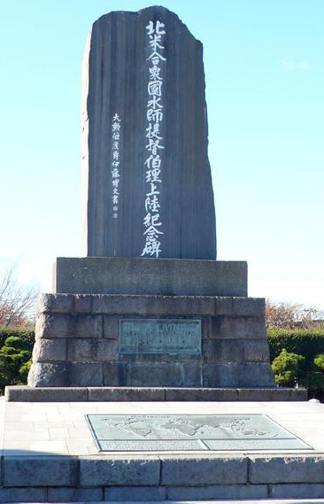
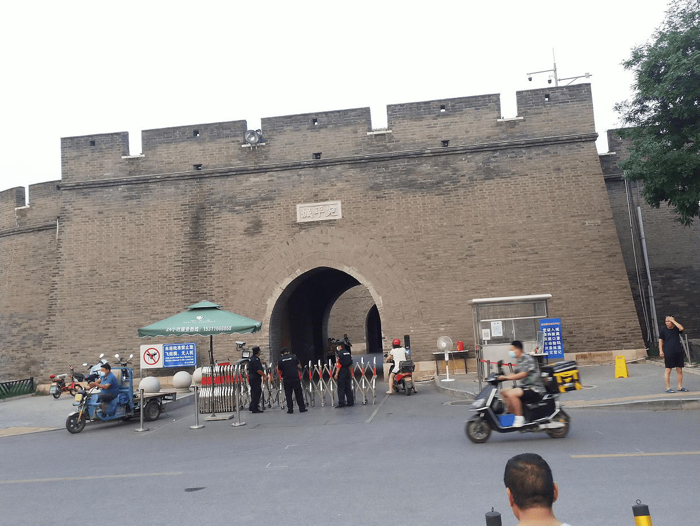

今年是共产党建党一百周年，清明节去了趟毛主席纪念堂瞻仰伟人，献了三束白菊花，从毛主席侧边经过，过道大概离他两米距离，他安详地躺在玻璃水晶棺内，头发还是黑色的，身长比印象中小些。那会天安门广场就在紧锣密鼓地布置七一建党100周年纪念场地了。

<!-- more -->  
从初中开始学习历史，到高中，再到考研政治的历史，虽然学习了很多年，但没有清晰的脉络，脑子里是一团浆糊，有必要理清历史，不然平常看新闻比较懵，比如建党处于什么历史背景？下面的问题不知道大家能答出几道？有的是看新闻后没想通的，有的是之前脑子里一团浆糊的历史，有的是亲身经历想到的。

* 为什么民国时期出了很多大师，社会看起来民主自由？
* 火烧圆明园和八国联军有关吗？
* 长征发生在什么历史背景下？
* 西安事变的背景是什么？
* 怎么看待文革？
* 怎么看待六四天安门事件？
* 2020年习近平到深圳纪念经济特区建立40周年，怎么看待目前的市场经济有些方面与裙带资本主义类似？
* 2021年共产党成立100周年，党、国家、军队三者是什么关系？
* 2021年辛亥革命110周年，孙中山主张建立资本主义国家，处于社会主义的我们为什么要大力宣扬纪念辛亥革命？
* 我的研究生导师陈意云和姚期智都是1946年出生（都做计算机工作），他们一个在内地经历上山下乡，一个在建国前后去了台湾，假如姚留在内地大概率也会去上山下乡，还会取得目前这样的成就吗？
* 港英时期香港繁荣发展，是亚洲四小龙之一，这段殖民历史看起来让香港发展地不错，怎么评价殖民呢？

下面先梳理下中国的近现代史，把自己想象成1000年后（公元三千年）的人看待这段历史，客观地谈谈我的想法，其中有的史实在今天的社会是避讳的，我想1000年后的人们会自由公开、风趣幽默地谈论吧，像我们现在谈1000年前的宋朝不用避讳什么，后人可能也会像《明朝那些事儿》、易中天《品三国》一样谈论我们。最近看了1997年的《邓小平》纪录片，他的一辈子贯穿了清朝结束到现代这段历史，我对这段历史做了一个总结，加上晚清共四段。

### 1. 清朝苟延残喘
1840~1842 第一次鸦片战争 《南京条约》 
1851~1864 太平天国运动（农民起义） 
 
1854 美国人Perry打开日本锁国的大门（类似第一次鸦片战争英国打开中国锁国大门） 
1856~1860 第二次鸦片战争；火烧圆明园 
1862~1894 同光中兴（洋务运动，学习西方） 
1868~1890s 日本明治维新（西化） 
 
1898.6.9 《展拓香港界址专条》租香港99年至1997年；百日维新（即戊戌变法） 
1900 义和团运动引发八国联军镇压 

### 2. 清朝结束后的战争年代（民国时期）
1911 清朝结束，辛亥革命果实被袁世凯窃取 
1914~1918 一战 
1919 五四运动（在此之前都试图建立资本主义国家） 
1921 共产党成立 
 
1924~1927 （国共合作）第一次国内革命战争/国民革命/大革命，含北伐战争 
1927~1937 （国共内战）第二次国内革命战争/第一次国共内战/十年内战/土地革命；西安事变 
1935 遵义会议，确立了毛泽东的领导地位，走革命路线 
1937~1945 （国共合作）抗日战争；皖南事变 
1945~1950 （国共内战）第三次国内革命战争/第二次国共内战/解放战争 

### 3. 毛的摸索阶段
1946~1953 土地改革 
1950~1953 抗美援朝 
1953~1956 社会主义改造/“三大改造” 集体化 
1959~1961 三年饥荒 
1966~1976 文化大革命 
1976 四五天安门事件 

### 4. 现代
1978 十一届三中全会，确立邓小平的领导地位，走改革开放路线 
1980 深圳等建立经济特区 
1989 六四天安门事件 
1992 南方讲话（稳定人心） 
1997.7.1 香港回归

第一段历史，清朝苟延残喘，当时清朝闭关锁国，而英国（1640~1688）、美国（1775~1783独立战争）、法国（1789~1794大革命）相继完成资产阶级革命，蒸汽时代来临了，欧美率先走上工业化道路，历史的车轮滚滚向前，所有的拦路者都将被碾碎，落后的国家会被挨打。1860年英国打开中国国门，其实当时的日本也是闭关锁国，1854年美国打开日本的国门，与他们签订第一个不平等条约《神奈川条约》，日本后来立碑纪念这位美国人Perry打开了他们国门，让他们意识到工业时代的来临，日本人挺有意思的哈哈，对这段历史感兴趣的读者可以看看袁腾飞老师讲明治维新的课程[1]。英国炮轰中国之后清朝各种寻求改变，试图走资本主义道路，洋务运动就是学习西方，与日本明治维新很像，时期相同，也都经历了30年左右，但由于中国封建制度太深重没有成功，日本的封建制度没有中国这么深，他们“脱亚入欧”成功，走上了资本主义道路，但毕竟是个东方国家，变革之后有点不伦不类，“西装穿得比欧美人还勤”，狭小的日本需要原料发展资本主义，只能发动战争来扩张，这期间就爆发了甲午中日战争，中国惨败。其实朝鲜（那时和韩国没有分裂，叫一个名字）当时也被日本侵略地很惨，完全沦为日本的殖民地。

 
日本人纪念打开他们国门的人Matthew Calbraith Perry

清朝各种尝试都不行，孙中山起义推翻了清朝，他也试图建立资本主义国家，但革命的果实被袁世凯窃取，他是个靠不住的人。一战时日本趁西方混战无暇东顾趁机来山东插一脚，一战胜利后试图夺走山东，导致1919年五四运动爆发，之后1921年共产党成立，“只有共产党才能救中国”，这就是共产党成立的背景。之后就和蒋介石领导的国民党分分合合。第一次合作打军阀，合作时双方会提防着对方，北伐后中国基本统一了，蒋介石试图独吞果实，国共分裂，然后打了十年内战，长征就发生在这个时候，为了保存共产党有限的力量。内战期间日本进攻中国愈演愈烈，1936年底张学良和杨虎城发动西安事变要求蒋介石与共产党合作共同抗日，1937年在丰台宛平城发生卢沟桥事变，中国抗日全面爆发，初期国共合作抗日还是很不错的，去年的电影《八佰》说的就是这个时候的国民党抗日。前面说了，合作的时候双方会提防着对方，抗日期间国民党就发动了皖南事变打共产党，再之后抗日成功，打完了日本，双方继续内战，终于共产党胜利，国民党退到台湾，这个时候其实不少仁人志士跟着国民党去了台湾，我想姚期智的父母就是其中一员吧。

 
今日的宛平城 摄于2021.8.7

新中国成立后，毛泽东的本意是好的，试图一步到位社会主义、共产主义，圣人千虑，必有一失，当时生产力及经济基础不行，强行搞美好社会是打肿脸充胖子，常听上一辈的人讲那段历史，“大队时期干活记工分”，“谁手上老茧多谁去上学”，我的研究生导师陈意云在文革时期去上山下乡了，我看到他的自述[2]很震撼，习近平和李克强也是那时上山下乡的一员，但这些知青们心有猛虎，始终没有忘却理想，高考恢复后继续上大学了[3]。

1976年毛泽东逝世，四人帮随之倒台，其实这个时候大家都有点迷茫，未来的道路再怎么走？1978年十一届三中全会上确立邓小平的领导地位，走改革开放路线，有的人放不开，在想那是不是资本主义？邓小平拍板没有问题，从此中国进入现代化，1980年在深圳建立经济特区，发展了三十多年后深圳吸收了全国的精英，我大学毕业后也毅然决然地南下深圳工作。改革开放的道路上必然有绊脚石，在开始的过渡期，计划经济和市场经济同时存在，有的商品在市场经济下一个价，在计划经济下一个价（比市场价低），贪污的官员有利可图，所谓“价格双轨”、“官倒”，百姓积怨深重，我想这就是为什么共产党一直强调反腐。经济改革放开了，大家对政治改革的呼声也越来越高，要民主和自由，86年我的母校中国科学技术大学的学生发起学潮，当时的副校长方励之是支持的（其实后来的学潮有不少知识分子也支持），再加上后来东欧剧变影响中国人的意识形态想法，一系列因素积压在一起，导致89年在天安门发生学潮，没办法不得不用武力解决。为了解答大家对社会主义/资本主义发展的疑惑，邓小平92南巡，说明中国姓“社”，但是是中国特色的社会主义，也可以搞市场经济，我一直在想，走社会主义还是资本主义最终是为了什么？我觉得是提升人们的生活水平、知识水平，提升人们的幸福感，如果每个国家有满意度调查且不穿小鞋就好了哈哈。再后来到了97年，邓小平逝世，香港给英国99年的租期到了，可惜他没看到回归的一幕。

以上就是我的想法，如果有不正确的地方欢迎留言指出。

[1] 袁腾飞 《明治维新 上》 <a href="https://www.youtube.com/watch?v=QwKSdRy57BA" target="_blank">https://www.youtube.com/watch?v=QwKSdRy57BA</a> 《明治维新 下》 <a href="https://www.youtube.com/watch?v=8zlqgi-yPM0" target="_blank">https://www.youtube.com/watch?v=8zlqgi-yPM0</a>

[2] 陈意云 《回忆录：两次高考之间的十三年知青生涯—纪念上山下乡50周年》 <a href="http://staff.ustc.edu.cn/~yiyun/papers/50th%20Anniversary.doc" target="_blank">http://staff.ustc.edu.cn/~yiyun/papers/50th%20Anniversary.doc</a>

[3] 习近平在恢复高考前的1975年上大学

[4] 福泽谕吉《脱亚论》原文配白话译文 <a href="https://m.douban.com/note/510380221/" target="_blank">https://m.douban.com/note/510380221/</a> （链接可能需要在手机上打开）
