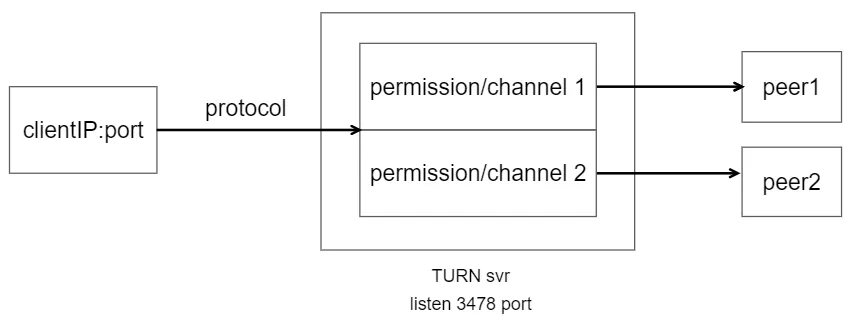
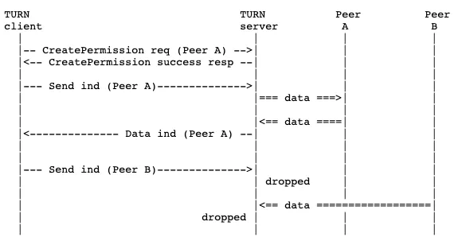
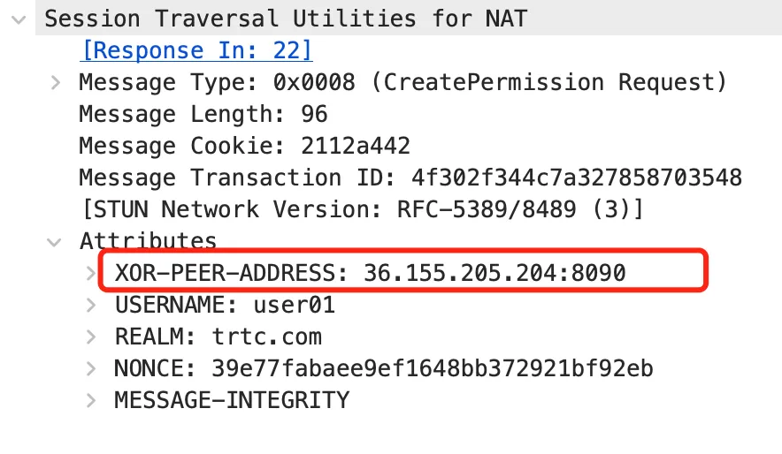
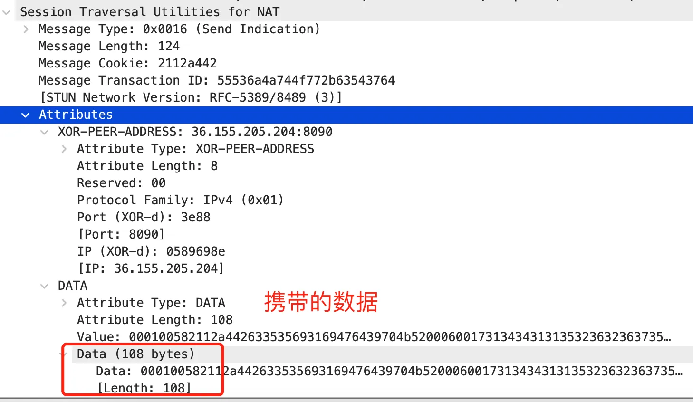
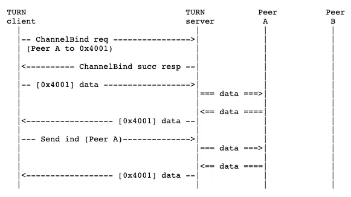
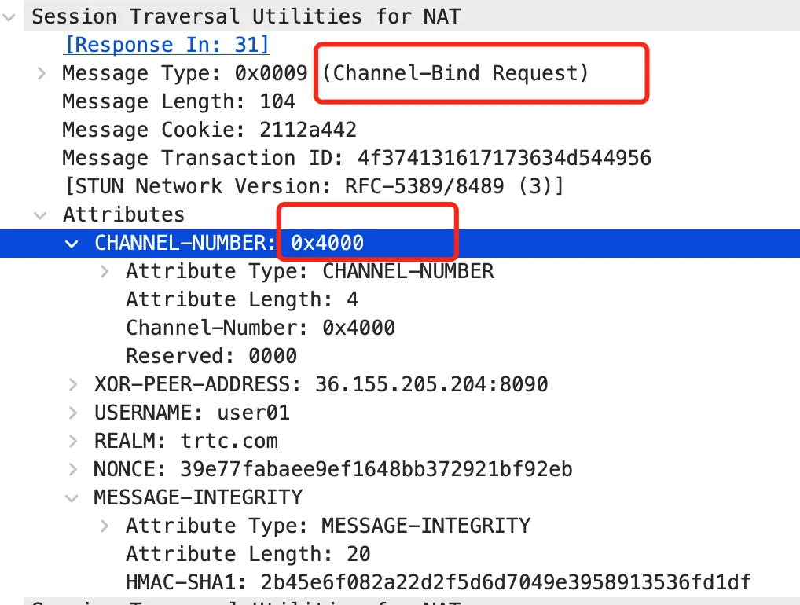
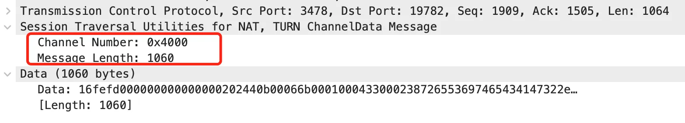

WebRTC 是2011年谷歌开源的媒体框架，可以在浏览器中进行实时音视频通信，它是为P2P通信设计的，开发者也可以自己搭建服务器作为通信的一端。在下面这些网络条件限制严格的场景下不能直接建立通信，需要借助中转服务器TURN（Traversal Using Relays around NAT）转发。

 1. **一端是对称型NAT，另一端是端口限制锥形NAT或者也是对称型NAT**，无法建立P2P。这个工具可以检测自己网络的NAT类型 <a href="https://github.com/aarant/pynat" target="_blank">https://github.com/aarant/pynat</a>
 2. 对网络出口限制严格的环境，比如银行、政府单位，要求访问的外网IP地址需要加到其网关白名单。可以独立部署TURN服务器，将TURN的公网IP地址加到白名单。
 3. 对安全要求极端严格的防火墙，不允许UDP通信，甚至只允许TLS over 443端口的流量。

# TURN 流程分析
协议分为三部分
 1. 在TURN服务器上创建传输**资源，称为 allocation**
 2. indication 方式传输数据
 3. channel 方式传输数据

要注意的是，这两种传输数据的方式是并列关系。三部分的流程时序图如下（可右键打开，放大查看文本格式），client参考WebRTC代码，server参考pion/turn代码。
<!-- more -->  

<p style="text-align: center">

<br />
TURN时序图
</p>

## 1. 创建 allocation 资源
allocation是TURN服务器分配给客户端的资源，数据结构如下，列了主要的字段（详见 <a href="https://github.com/pion/turn/blob/master/internal/allocation/allocation.go#L23" target="_blank">https://github.com/pion/turn/blob/master/internal/allocation/allocation.go#L23</a> ）。以五元组 fiveTuple <clientIP, clientPort, svrIP, svrPort, protocol>标识一个allocation，protocol 最新的RFC文档规定有TCP/UDP/TLS/DTLS，pion暂未支持DTLS，服务端监听端口 svrPort 默认是3478 for TCP/UDP, 5349 for TLS/DTLS。

``` golang
// FiveTuple is the combination (client IP address and port, server IP
// address and port, and transport protocol (currently one of UDP,
// TCP, or TLS)) used to communicate between the client and the
// server.  The 5-tuple uniquely identifies this communication
// stream.  The 5-tuple also uniquely identifies the Allocation on
// the server.
type FiveTuple struct {
	Protocol
	SrcAddr, DstAddr net.Addr
}

type Allocation struct {
	RelayAddr           net.Addr
	Protocol            Protocol
	TurnSocket          net.PacketConn
	RelaySocket         net.PacketConn
	fiveTuple           *FiveTuple
	permissionsLock     sync.RWMutex
	permissions         map[string]*Permission
	channelBindingsLock sync.RWMutex
	channelBindings     []*ChannelBind
	lifetimeTimer       *time.Timer
}
```

<p style="text-align: center">

<br />
allocation结构
</p>

特别关注数据结构中的 permissions 和 channelBindings 字段，permissions的key是peer端地址，channelBindings是数组，也是以peer端地址标识。下面对照时序图介绍流程。

### 1.1 STUN bind request
和STUN功能一样，返回client的IP和port，用于告知端上自己的出口地址，收集local candidate，服务端无状态。

### 1.2 allocation request
请求分配资源，请求参数中标识了在TURN和peer之间是UDP还是TCP，WebRTC client写死的UDP，注意RFC文档是规范，WebRTC是实现，它没有实现标准中规定的所有功能。从下面的源码可以看出，请求中没有带 MAC 码AttrMessageIntegrity，返回 401 错误码CodeUnauthorized，并返回realm和随机数。这里反错是正常流程，就是为了将服务端的一些参数带会给端上。

``` go
func authenticateRequest(r Request, m *stun.Message, callingMethod stun.Method) (stun.MessageIntegrity, bool, error) {
	respondWithNonce := func(responseCode stun.ErrorCode) (stun.MessageIntegrity, bool, error) {
		nonce, err := buildNonce()
		if err != nil {
			return nil, false, err
		}

		// Nonce has already been taken
		if _, keyCollision := r.Nonces.LoadOrStore(nonce, time.Now()); keyCollision {
			return nil, false, errDuplicatedNonce
		}

		return nil, false, buildAndSend(r.Conn, r.SrcAddr, buildMsg(m.TransactionID,
			stun.NewType(callingMethod, stun.ClassErrorResponse),
			&stun.ErrorCodeAttribute{Code: responseCode},
			stun.NewNonce(nonce),
			stun.NewRealm(r.Realm),
		)...)
	}

	if !m.Contains(stun.AttrMessageIntegrity) {
		return respondWithNonce(stun.CodeUnauthorized)
	}
	...
}
```

端上收到响应后设置realm、随机数，计算MAC码= MD5(username ":" realm ":" SASLprep(password))，下一步会带上MAC码，端上处理回包详见 TurnAllocateRequest::OnAuthChallenge  <a href="https://source.chromium.org/chromium/chromium/src/+/main:third_party/webrtc/p2p/base/turn_port.cc;l=1439" target="_blank">https://source.chromium.org/chromium/chromium/src/+/main:third_party/webrtc/p2p/base/turn_port.cc;l=1439</a>

### 1.3 第二次 allocation request
端上携带 MAC 码、realm和上一步返回的随机数，再次请求分配 allocation，服务端校验MAC码，ok后创建 Allocation 数据结构，并给 lifetimeTimer 字段赋定时器，资源保活时间默认10分钟，WebRTC 端上会提前一分钟发心跳保活，也就是每9分钟发一次心跳；客户端如果想释放资源，在refresh request请求参数中将lifetime填0，下一节会讲。分配资源后，服务端进程<font color="red">bind 一个 UDP port</font>，用于和peer通信，for 循环等待着从peer收包。

``` go
func (m *Manager) CreateAllocation(fiveTuple *FiveTuple, turnSocket net.PacketConn, requestedPort int, lifetime time.Duration) (*Allocation, error) {
	...
	go a.packetHandler(m)
	...
}

// 从relay端口（UDP）收包处理
func (a *Allocation) packetHandler(m *Manager) {
	buffer := make([]byte, rtpMTU)

	for {
		n, srcAddr, err := a.RelaySocket.ReadFrom(buffer)
		if err != nil {
			m.DeleteAllocation(a.fiveTuple)
			return
		}

		a.log.Debugf("relay socket %s received %d bytes from %s",
			a.RelaySocket.LocalAddr().String(),
			n,
			srcAddr.String())
		...
	}
}
```

### 1.4 allocation refresh request
请求参数中指定多久(即expire)之后释放资源，如果传0表示立即释放资源，端上定时刷新 expire，也就是定时保活。

## 2. indication 方式传输数据

<p style="text-align: center">

<br />
indication方式概览 from RFC
</p>

### 2.1 create permission
用indication方式传数据前，先请求权限。端上add remote candidate时，创建 `TurnEntry` 对象，在构造函数中发送create permission请求，请求参数中携带了peer地址。

``` cpp
TurnEntry::TurnEntry(TurnPort* port, Connection* conn, int channel_id)
    : port_(port),
      channel_id_(channel_id),
      ext_addr_(conn->remote_candidate().address()),
      state_(STATE_UNBOUND),
      connections_({conn}) {
  // Creating permission for `ext_addr_`.
  SendCreatePermissionRequest(0);
}
```
from <a href="https://source.chromium.org/chromium/chromium/src/+/main:third_party/webrtc/p2p/base/turn_port.cc;l=1764" target="_blank">https://source.chromium.org/chromium/chromium/src/+/main:third_party/webrtc/p2p/base/turn_port.cc;l=1764</a>


<p style="text-align: center">

<br />
create permission 抓包
</p>

服务器收到信令后，在 Allocation 结构体的 permissions map 中增加一个kv，key是peer地址，标识了这个permission，同时创建定时器，超时的话删除这个permission，超时时间5min，最后回包给端上。

端上收到回包后准备好下次发心跳保活：

``` cpp
void TurnEntry::OnCreatePermissionSuccess() {
  RTC_LOG(LS_INFO) << port_->ToString() << ": Create permission for "
                   << ext_addr_.ToSensitiveString() << " succeeded";
  if (port_->callbacks_for_test_) {
    port_->callbacks_for_test_->OnTurnCreatePermissionResult(
        TURN_SUCCESS_RESULT_CODE);
  }

  // If `state_` is STATE_BOUND, the permission will be refreshed
  // by ChannelBindRequest.
  if (state_ != STATE_BOUND) {
    // Refresh the permission request about 1 minute before the permission
    // times out.
    TimeDelta delay = kTurnPermissionTimeout - TimeDelta::Minutes(1);
    SendCreatePermissionRequest(delay.ms());
    RTC_LOG(LS_INFO) << port_->ToString()
                     << ": Scheduled create-permission-request in "
                     << delay.ms() << "ms.";
  }
}
```
from <a href="https://source.chromium.org/chromium/chromium/src/+/main:third_party/webrtc/p2p/base/turn_port.cc;l=1846" target="_blank">https://source.chromium.org/chromium/chromium/src/+/main:third_party/webrtc/p2p/base/turn_port.cc;l=1846</a>

### 2.2 indication
端上传输数据发送至服务器的信令叫 send indication, 服务端发向端上叫 data indication。（感觉这个命名不太对应）

send indication的头部overhead相对channel的较大，有36B，其中指定了peer地址，也就是要发向谁。服务器会根据peer地址查找permission是否存在，存在的话则取出承载的数据发向peer。

<p style="text-align: center">

<br />
send indication 抓包
</p>

收到peer的包时检查channel方式是否建立了，如果建立了优先用channel方式，没有建立则用permission方式发回给端上，data indication结构和send indication相同。

看完上面这种传输方式，觉得有什么问题吗？

注意到create permission时peer地址可以由客户端任意指定，如果服务部署在内网，用户可能恶意扫描内网服务器，类似 SSRF (Server-side request forgery) 漏洞，见这个报告 <a href="https://hackerone.com/reports/333419?from_wecom=1" target="_blank">https://hackerone.com/reports/333419?from_wecom=1</a>

*The attacker may proxy TCP connections to the internal network by setting the  `XOR-PEER-ADDRESS`  of the TURN connect message (method  `0x000A` , <a href="https://tools.ietf.org/html/rfc6062#section-4.3" target="_blank">https://tools.ietf.org/html/rfc6062#section-4.3</a> ) to a private IPv4 address.*

*UDP packets may be proxied by setting the  `XOR-PEER-ADDRESS`  to a private IP in the TURN send message indication (method  `0x0006` , <a href="https://tools.ietf.org/html/rfc5766#section-10" target="_blank">https://tools.ietf.org/html/rfc5766#section-10</a> ).*

比如内网某台服务器部了HTTP服务给内网使用的，创建资源时端上指定TURN和peer之间是TCP方式（pion/turn不支持，coturn支持），后续创建permission和send indication时指定peer address是内网地址（暴力穷举），将HTTP请求包装在TURN协议中，这样就获取了内网服务器上的数据。

下一节要介绍的传输方式也有这个问题，解决方法的话，如果只是为了WebRTC中转，WebRTC只用到UDP，可以禁掉TURN分配TCP relay端口功能，然后将常用协议的UDP端口也封禁，或者校验peer地址，可以详细看下原贴中作者说的。

## 3. channel 方式传输数据

<p style="text-align: center">

<br />
channel 方式概览 from RFC
</p>


### 3.1 channel bind request
与permission方式类似，发数据前先请求创建通道，它在`TurnEntry`对象发送真实数据时请求创建，见下面的代码，关键字 `SendChannelBindRequest`。


``` cpp
int TurnEntry::Send(const void* data,
                    size_t size,
                    bool payload,
                    const rtc::PacketOptions& options) {
  rtc::ByteBufferWriter buf;
  if (state_ != STATE_BOUND ||
      !port_->TurnCustomizerAllowChannelData(data, size, payload)) {
    // If we haven't bound the channel yet, we have to use a Send Indication.
    // The turn_customizer_ can also make us use Send Indication.
    TurnMessage msg(TURN_SEND_INDICATION);
    msg.AddAttribute(std::make_unique<StunXorAddressAttribute>(
        STUN_ATTR_XOR_PEER_ADDRESS, ext_addr_));
    msg.AddAttribute(
        std::make_unique<StunByteStringAttribute>(STUN_ATTR_DATA, data, size));

    port_->TurnCustomizerMaybeModifyOutgoingStunMessage(&msg);

    const bool success = msg.Write(&buf);
    RTC_DCHECK(success);

    // If we're sending real data, request a channel bind that we can use later.
    if (state_ == STATE_UNBOUND && payload) {
      SendChannelBindRequest(0);
      state_ = STATE_BINDING;
    }
  } else {
    // If the channel is bound, we can send the data as a Channel Message.
    buf.WriteUInt16(channel_id_);
    buf.WriteUInt16(static_cast<uint16_t>(size));
    buf.WriteBytes(reinterpret_cast<const char*>(data), size);
  }
  rtc::PacketOptions modified_options(options);
  modified_options.info_signaled_after_sent.turn_overhead_bytes =
      buf.Length() - size;
  return port_->Send(buf.Data(), buf.Length(), modified_options);
}
```
from <a href="https://source.chromium.org/chromium/chromium/src/+/main:third_party/webrtc/p2p/base/turn_port.cc;l=1846" target="_blank">https://source.chromium.org/chromium/chromium/src/+/main:third_party/webrtc/p2p/base/turn_port.cc;l=1846</a>

创建请求中的有一个重要字段 channel number，由端上生成，标识了这个通道，通道号取值规定

 - 0x0000-0x3FFF: 不能用来作为信道号
 - 0x4000-0x7FFF: 可以作为信道号的值(16383个)
 - 0x8000-0xFFFF: 保留值，留给以后使用

<p style="text-align: center">

<br />
channel bind request 抓包
</p>

服务端收到创建请求后，在`Allocation`结构体的`channelBindings`数组中增加一项，通道号或peer地址标识了这个channel，同时创建定时器，超时时间10分钟。如果channel已创建，则刷新expire。另外**bind request都会刷新permission的expire**。最后回包给端上。

端上收到回包后也是准备好下次心跳保活，在超时前一分钟刷新心跳。

``` cpp
void TurnChannelBindRequest::OnResponse(StunMessage* response) {
  RTC_LOG(LS_INFO) << port_->ToString()
                   << ": TURN channel bind requested successfully, id="
                   << rtc::hex_encode(id())
                   << ", code=0"  // Makes logging easier to parse.
                      ", rtt="
                   << Elapsed();

  if (entry_) {
    entry_->OnChannelBindSuccess();
    // Refresh the channel binding just under the permission timeout
    // threshold. The channel binding has a longer lifetime, but
    // this is the easiest way to keep both the channel and the
    // permission from expiring.
    TimeDelta delay = kTurnPermissionTimeout - TimeDelta::Minutes(1);
    entry_->SendChannelBindRequest(delay.ms());
    RTC_LOG(LS_INFO) << port_->ToString() << ": Scheduled channel bind in "
                     << delay.ms() << "ms.";
  }
}
```

from <a href="https://source.chromium.org/chromium/chromium/src/+/main:third_party/webrtc/p2p/base/turn_port.cc;l=1732" target="_blank">https://source.chromium.org/chromium/chromium/src/+/main:third_party/webrtc/p2p/base/turn_port.cc;l=1732</a>


### 3.2 channel data
从上一节发送真实数据的代码`TurnEntry::Send()`中可以看到，发数据时如果channel方式已创建则用channel方式传输（即优先channel方式发送），它的overhead只有4B，比indication方式overhead少多了：

<p style="text-align: center">

<br />
channel data 抓包
</p>


看完以上两种传输方式，我产生一个疑问，channel方式比permission方式overhead更少，而且发心跳时也可以刷新permission的expire，说白了功能更加强大，是否可以只用channel方式，在初始时（`TurnEntry`构造函数）用channel bind代替create permission呢？

在 stackoverflow 上问了这个问题 <a href="https://stackoverflow.com/questions/75611078/why-not-use-only-channel-data-in-webrtc-turn-client" target="_blank">https://stackoverflow.com/questions/75611078/why-not-use-only-channel-data-in-webrtc-turn-client</a> ，一位WebRTC大佬提到ICE RFC 5245文档，当中<font color="red">推荐</font>ICE过程结束后再创建channel，也就是candidate pair选中后创建。其实TURN的文档里压根不关心携带的数据具体是什么，candidate 概念是WebRTC ICE的，ICE文档中推荐这么用，我认为native端可以优化改成只用channel方式。

最后总结下，请求类的协议后台需要**鉴权MAC码**，有allocation的分配和刷新请求、create permission请求、channel bind请求。TURN中涉及三种**定时器**，对应文中三部分，端上需要定时发“心跳”保活，其中 permission 可以由 channel bind 保活。


参考文献

[1] TURN RFC 8656 (2020年) <a href="https://datatracker.ietf.org/doc/html/rfc8656" target="_blank">https://datatracker.ietf.org/doc/html/rfc8656</a>

[2] stun协议笔记二（webrtc之turn流程简介）by crystlhuang <a href="https://blog.csdn.net/CrystalShaw/article/details/103505029" target="_blank">https://blog.csdn.net/CrystalShaw/article/details/103505029</a>
