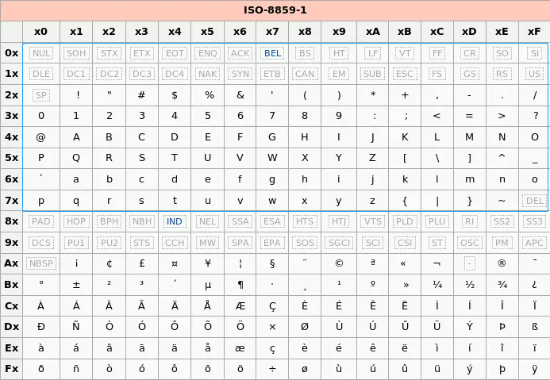

记得几年前有次需要写个简单的脚本，开始用的Python碰到中文编码问题，Python2和3还不一样，感觉比较复杂，后来不折腾了改用Ruby分分钟搞定，从那时就对Python没啥好感，至少没有Ruby开发效率高，Python以缩进表示层级有时也带来不便，其他语言可以用clang-format自动格式化，就能保持风格一致了。

Python在AI的生态很好，最近写这块程序碰到`bytes`和`str`转换时字符编码的问题，平常也时常碰到乱码的困惑，比如打开文件或者浏览网页乱码，尝试换一下编码就ok了，但是没有深究原理。这次彻底把字符编码弄清楚了。

下面说下常见的编码，ASCII, latin-1, Unicode, UTF-8(UTF-16/32)，这几种在Python中常见。

<!-- more -->  

# 1. ASCII
首先是熟悉的ASCII，占7bit，很早以前用多余的1bit作校验（《松本行弘的程序世界》中讲了历史），英语世界没有问题。

# 2. latin-1
欧洲国家 latin-1（也称ISO 8859-1），是ASCII的超集, 每个字符只占一个字节，把剩余的1位用上了。

> 此字符集支持部分于欧洲使用的语言，包括阿尔巴尼亚语、巴斯克语、布列塔尼语、加泰罗尼亚语、丹麦语、荷兰语、法罗语、弗里西语、加利西亚语、德语、格陵兰语、冰岛语、爱尔兰盖尔语、意大利语、拉丁语、卢森堡语、挪威语、葡萄牙语、里托罗曼斯语、苏格兰盖尔语、西班牙语及瑞典语。
> 
> 英语虽然没有重音字母，但仍会标明为ISO/IEC 8859-1编码。除此之外，欧洲以外的部分语言，如南非荷兰语、斯瓦希里语、印尼语及马来语、菲律宾他加洛语等也可使用ISO/IEC 8859-1编码。
> 
> 法语及芬兰语本来也使用ISO/IEC 8859-1来表示。但因它没有法语使用的 œ、Œ、Ÿ 三个字母及芬兰语使用的 Š、š、Ž、ž ，故于1998年被ISO/IEC 8859-15所取代。（ISO 8859-15同时加入了欧元符号）


<p style="text-align: center">

<br />
latin-1 编码表
</p>


# 3. Unicode
还有中文、日语等等，Unicode顾名思义，包括了所有字符，关键要注意的一点是，<font color="red">它不是编码方式，它只是字符集</font>，就是说ISO组织把所有的字符编了个号，到2022年是14万多个字符，它其实和怎么在磁盘存储、网络传输（这两种涉及序列化）编码的方式没有关系。

有的人可能会想，把这14万个字符用3个字节足以表示了，但是欧美国家的人大部分用不到，每个字符都用3字节浪费了。

# 4. UTF-8
UTF全称 Unicode Transformation Format，这是一种将Unicode编码的节省空间的方式，不是通通都用3个字节表示字符。我觉得和哈夫曼编码思想很像，前缀不能冲突。下面看下编码。

## 4.1 编码
Python中的`str`数据类型的每个字符是Unicode（本文都是讲Python3，注意这个坑点：Python2的`str`和Python3的`str`不一样，和Python3的`bytes`是一样的），编码指用某种编码格式将一个字符编码成多个字节，ASCII码和 latin-1 都是一个字符对应一个字节，UTF-8一个字符对应多个字节。

利用前缀思想，我开始自己设计了一个方式，比UTF-8更节省空间：

|字节数 |UTF-8 |
| -------- | ---- |
|1  |0xxxxxxx 利用7bit |
|2  |10xxxxxx xxxxxxxx 利用 14bit |
|3  |110xxxxx xxxxxxxx xxxxxxxx 利用 21bit|
|4  |1110xxxx xxxxxxxx xxxxxxxx xxxxxxxx 利用 28bit|
|n  | 利用 <font color="red">7n bit</font>|

前面n-1个1开头，指明本字符占n个字节，能表示7n个bit。

而UTF-8只能表示5n+1个bit（本式的n是UTF-8开头1的个数，ASCII例外），规则如下，乍一看规则比我设计的要复杂，其规则是 >=2字节的，有几个1开头就表示共占几个字节，从第2个字节开始固定以10开头。

|字节数 |Unicode |UTF-8 |
| -------- | --------| ----- |
|1 |U+0000 ~ U+007F |0xxxxxxx 利用7bit |
|2 |U+0080 ~ U+07FF |110xxxxx 10xxxxxx 利用 11bit |
|3 |U+0800 ~ U+FFFF |1110xxxx 10xxxxxx 10xxxxxx 利用 16bit|
|4 |U+10000 ~ U+10FFFF |11110xxx 10xxxxxx 10xxxxxx 10xxxxxx 利用 21bit|
|n | |利用 <font color="red">5n+1 bit</font>|

它为什么这么复杂呢？其实它还考虑了实际场景，我的设计需要严丝合缝，从头开始解析不能出一点错，而实际场景可能文件开始有一点错，希望能从中途开始最大程度地解析，这就是为什么UTF-8从第2个字节开始固定以10开头的原因了，它和ASCII不冲突，也与前缀（110, 1110 ...）不冲突，不魁是 Robe Pike 和 Ken Thompson 设计的。


另外注意 <font color="red">latin-1 和 Unicode 编码方式不兼容</font>。

例如，重音字符会在latin-1字符集和Unicode字符集中同时存在，但是通过latin-1和Unicode编码方式编出来的字节流是不一样的，注意，虽然Unicode字符集是包含了latin-1字符集，但是不代表UTF-8编码方式兼容latin-1编码方式。因为Unicode字符集中除了ASCII字符集外，都是采用多字节的编码方式，而latin-1一律采用单字节的方式。

``` python
s = 'Äè'
print(s.encode('utf-8'))
print(s.encode('latin-1'))

b'\xc3\x84\xc3\xa8'
b'\xc4\xe8'
```

UTF-16/32思想和UTF-8差不多，就是基础字节用了2B/4B，不太流行。

## 4.2 解码

将字节流（二进制流/`bytes`）按某种编码方式“解释”，例如下面的b变量（字节流）含6个字节。


``` python
b = b'\xe6\x8e\x92\xe7\x90\x83'
s1 = b.decode(encoding='utf-8')
s2 = b.decode() # 用系统默认编码方式，通常是UTF-8?
s3 = b.decode(encoding='latin-1') # 每个字符一个字节，强行“解释”，仔细看下面的乱码，有6个

print(s1)
print(s2)
print(s3)

排球
排球
排球
```


``` python
s = 'AÄBèC'  # Unicode 5 字符

with open('utf-8data','w',encoding='utf-8') as f:
   f.write(s) # UTF-8编码写磁盘，7个字节（观察第二、第四个字符特殊，各占两字节）


with open('utf-8data', 'rb') as f:
   byte_str = f.read()

print(byte_str)
print(byte_str.decode(encoding='utf-8'))

b'A\xc3\x84B\xc3\xa8C' # A B C 正常打印，第二、第四个字符特殊，打印十六进制
AÄBèC
```

# 5. 文件头magic number
用以上各种编码保存成文件，再打开时文本编辑器怎么“解释”呢？用文件头magic number区分。

打开“记事本”程序 notepad.exe，新建一个文本文件，内容就是一个“严”字（Unicode U+4E25），依次采用ANSI，Unicode，Unicode big endian和UTF-8编码方式保存。

然后，用文本编辑软件 UltraEdit 中的“十六进制功能”，观察该文件的内部编码方式。

1）ANSI：对于英文文件是ASCII编码，对于简体中文文件是GB2312编码（只针对 Windows 简体中文版，如果是繁体中文版会采用 Big5 码）

文件的编码就是两个字节D1 CF，这正是严的 GB2312 编码，这也暗示 GB2312 是采用大头方式存储的。

2）Unicode：notepad.exe 使用的 UCS-2 编码方式，即直接用两个字节存入字符的 Unicode 码，这个选项用的 little endian 格式。

编码是四个字节FF FE 25 4E，其中FF FE表明是小头方式存储，真正的编码是4E25。

3）Unicode big endian：编码是四个字节FE FF 4E 25，其中FE FF表明是大头方式存储。

4）UTF-8：编码是六个字节EF BB BF E4 B8 A5，前三个字节EF BB BF表示这是UTF-8编码，后三个E4B8A5就是严的具体编码，它的存储顺序与编码顺序是一致的：

“严”的 Unicode 4E25 即 0100 1110 0010 0101 用 UTF-8  1110xxxx 10xxxxxx 10xxxxxx  方式存储填充：1110 0100 10 1110 00 10 100101 即 E4 B8 A5。


参考资料

[1] latin-1 介绍 https://en.wikipedia.org/wiki/ISO/IEC_8859-1

[2] 文中程序示例来自 https://zhuanlan.zhihu.com/p/31920527

[3] 文件头一节来自 https://blog.csdn.net/Deft_MKJing/article/details/79460485
