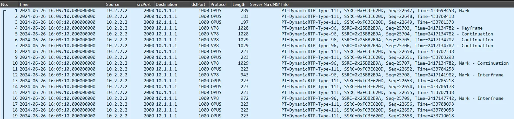
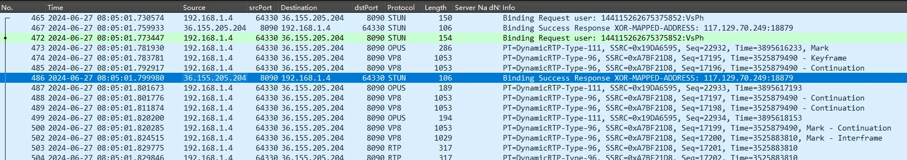

WebRTC 默认使用加密协议 SRTP 传输数据，抓包时看不到明文，不便于排查问题。

一种方法是下载开发版浏览器关闭加密选项，需要通讯的对端支持；

另一种方法是打开浏览器的 debug 选项，dump SRTP 解密后的 RTP 数据，下面先介绍这种方法。

# 1. dump RTP 明文
以 Windows 为例，**关闭所有浏览器实例后**，cmd下使用下面的选项打开浏览器，浏览器路径换成你的。
```batch
"C:\Program Files\Google\Chrome\Application\chrome.exe" --enable-logging --v=1 --force-fieldtrials=WebRTC-Debugging-RtpDump/Enabled/
```

- 其他平台打开日志的方法类似，详见 <a href="https://support.google.com/chrome/a/answer/6271282#zippy=%2Cwindows%2Cmac%2Clinux" target="_blank">https://support.google.com/chrome/a/answer/6271282#zippy=%2Cwindows%2Cmac%2Clinux</a> （移动平台待补充），Windows上的日志路径是 `%LOCALAPPDATA%\Google\Chrome\User Data`，也可以使用环境变量 `CHROME_LOG_FILE` 或选项例如 `--log-file="C:\\tmp\\testchrome.log"` 指定。Windows上cmd和PowerShell语法不同，上面的命令是在cmd下运行的。

- 打开试验性选项RTP dump （来源 <a href="https://source.chromium.org/chromium/chromium/src/+/main:third_party/webrtc/g3doc/field-trials.md" target="_blank">https://source.chromium.org/chromium/chromium/src/+/main:third_party/webrtc/g3doc/field-trials.md</a> ，浏览器所有选项文档 <a href="https://peter.sh/experiments/chromium-command-line-switches/" target="_blank">https://peter.sh/experiments/chromium-command-line-switches/</a> ）。

<!-- more -->  

浏览器在SRTP模块读取该选项，在RTP、RTCP加密前和SRTP、SRTCP解密后共4处dump，这样将明文RTP和RTCP打印到日志。
```c++
SrtpSession::SrtpSession(const webrtc::FieldTrialsView& field_trials) {
  dump_plain_rtp_ = field_trials.IsEnabled("WebRTC-Debugging-RtpDump");
}

...

// Logs the unencrypted packet in text2pcap format. This can then be
// extracted by searching for RTP_DUMP
//   grep RTP_DUMP chrome_debug.log > in.txt
// and converted to pcap using
//   text2pcap -D -u 1000,2000 -t %H:%M:%S. in.txt out.pcap
// The resulting file can be replayed using the WebRTC video_replay tool and
// be inspected in Wireshark using the RTP, VP8 and H264 dissectors.
void SrtpSession::DumpPacket(const void* buf, int len, bool outbound) {
  int64_t time_of_day = rtc::TimeUTCMillis() % (24 * 3600 * 1000);
  int64_t hours = time_of_day / (3600 * 1000);
  int64_t minutes = (time_of_day / (60 * 1000)) % 60;
  int64_t seconds = (time_of_day / 1000) % 60;
  int64_t millis = time_of_day % 1000;
  RTC_LOG(LS_VERBOSE) << "\n"
                      << (outbound ? "O" : "I") << " " << std::setfill('0')
                      << std::setw(2) << hours << ":" << std::setfill('0')
                      << std::setw(2) << minutes << ":" << std::setfill('0')
                      << std::setw(2) << seconds << "." << std::setfill('0')
                      << std::setw(3) << millis << " "
                      << "000000 "
                      << rtc::hex_encode_with_delimiter(
                             absl::string_view((const char*)buf, len), ' ')
                      << " # RTP_DUMP";
}
```
from <a href="https://source.chromium.org/chromium/chromium/src/+/main:third_party/webrtc/pc/srtp_session.cc;l=123?q=%22WebRTC-Debugging-RtpDump%22" target="_blank">https://source.chromium.org/chromium/chromium/src/+/main:third_party/webrtc/pc/srtp_session.cc;l=123?q=%22WebRTC-Debugging-RtpDump%22</a>

如上面代码注释中所说，接下来执行
```bash
grep RTP_DUMP chrome_debug.log > in.txt
text2pcap -D -u 1000,2000 -t %H:%M:%S. in.txt out.pcap
```
推荐安装 Wireshark，在安装目录带了 text2pcap 工具。

打开 out.pcap，解析为RTP，在【编辑】->【首选项】->【协议】设置OPUS等编码的RTP payload，可以看到明文包。


在Wireshark中的音视频抓包如何保存成媒体文件？开源项目 h264extractor [1] 支持H.264和OPUS的提取。将Lua脚本放到Wireshark安装目录的plugins目录即可（旧版的Wireshark安装Lua插件相对麻烦），我在Windows提取OPUS时报了错，提交了PR给这个项目。本来想自己写工具解析包的，后来看了这个工具，其实用Wireshark Lua插件更加合适，跨平台，方便调用Wireshark提供解析包的接口。

提取的H.264可直接播放，但是OPUS是帧长（4字节）+帧数据的形式保存的，不能直接播放，写了一个工具 opus_muxer [2] 将这种形式封装为WebM方便播放。

后续还可使用 WebRTC video_replay [3] 工具 replay 音视频，待补充。

# 2. 关闭SRTP方法

需要使用 Chromium、开发版Chrome或金丝雀版Chrome，提供了选项`--disable-webrtc-encryption` ，可以看到浏览器在STUN探测成功后就发RTP包了，绿色的是带use-candidate的STUN包，没有等回包就发媒体包了。这种方式需要PeerConnection对端也支持不加密，在SDP中协商，调试第三方系统时可能不支持。



如果要保存为音视频文件，可以参考第1节说的工具。

# 后记

端上dump明文音视频用于调试本身是很朴素的想法，如果是native端可操控性强，但是Web端就需要浏览器内部支持。另外如果是服务端伪装的PeerConnection对端，也可在服务器上dump明文。

在浏览器解密SRTP后获取音视频数据，同样的想法理论上也可以应用到点播或直播，将音视频在HTTPS(TLS)解密后或H5 video标签播放前将音视频数据dump出来。


参考资料

[1] 解析抓包保存音视频文件 <a href="https://github.com/volvet/h264extractor" target="_blank">https://github.com/volvet/h264extractor</a>

[2] 封装 OPUS raw frame <a href="https://github.com/Justme0/opus_muxer" target="_blank">https://github.com/Justme0/opus_muxer</a>

[3] video_replay 工具 <a href="https://webrtchacks.com/video_replay/" target="_blank">https://webrtchacks.com/video_replay/</a>

[4] Firefox 调试加密包 <a href="https://stackoverflow.com/questions/53292936/analyzing-rtp-packets-from-browsers-webrtc-stream-using-wireshark-or-similar-to" target="_blank">https://stackoverflow.com/questions/53292936/analyzing-rtp-packets-from-browsers-webrtc-stream-using-wireshark-or-similar-to</a>
