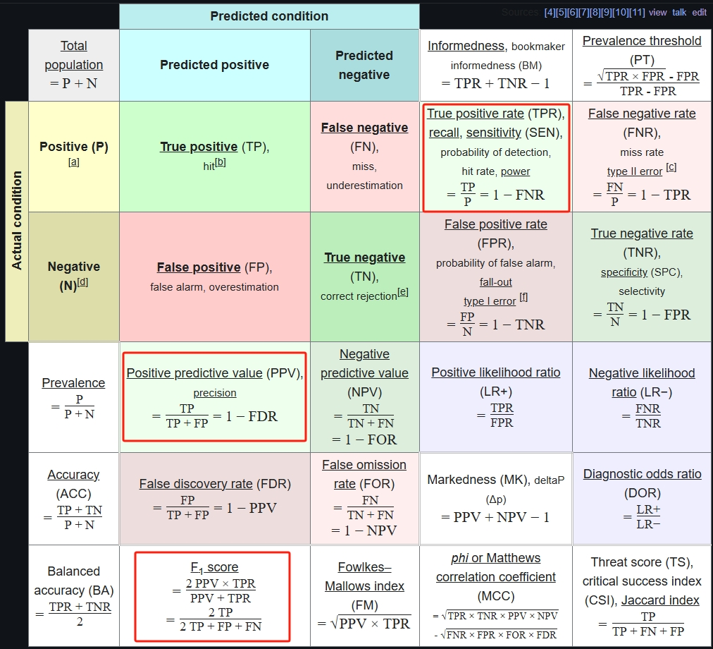
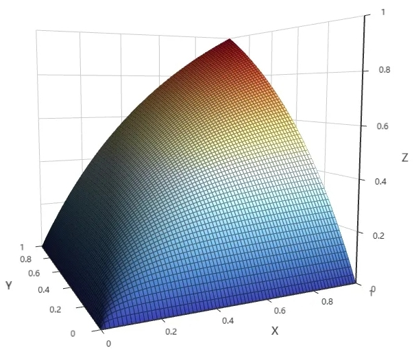
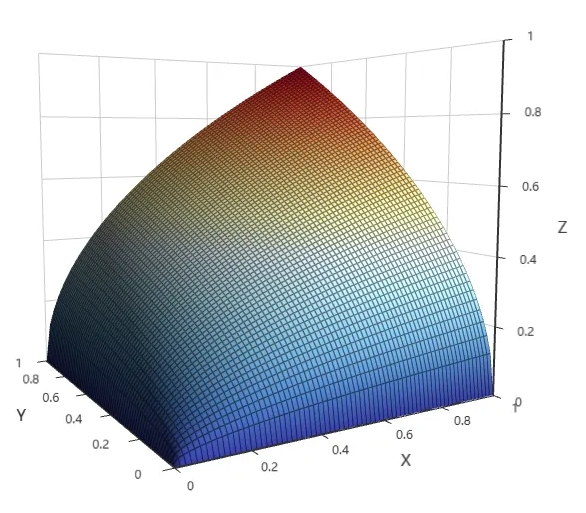
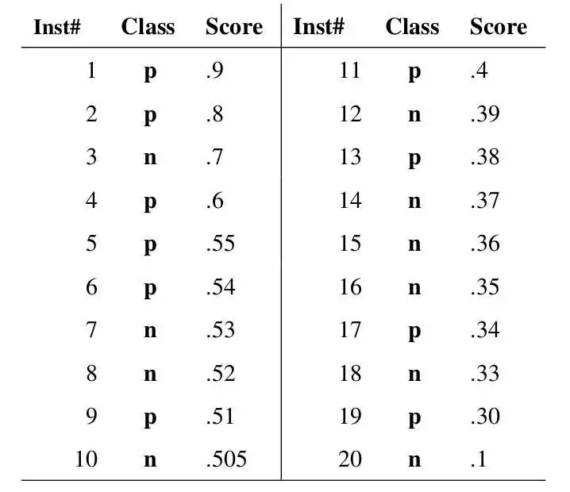
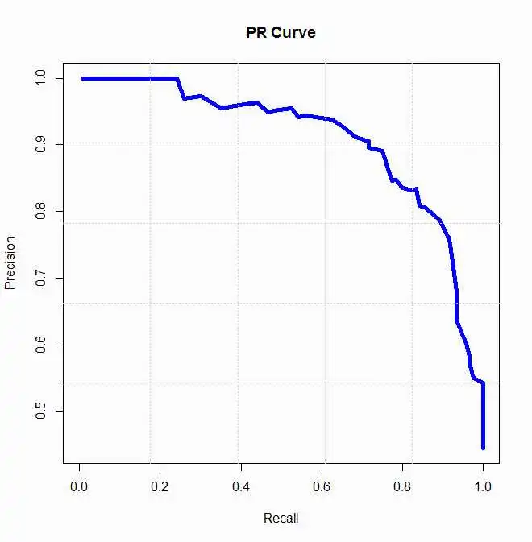

如何量化机器学习的模型性能？本文整理了机器学习模型性能度量指标，主要是我对这些指标的一些思考。这里说的“性能”指模型泛化（即预测）能力 performance，不是指在机器上运行消耗资源的多少。

# 1. recall & precision

最常见的指标有recall（召回率，查全率），precision（查准率）。“召回”一词来自制造业，比如某款汽车售卖到市场上后发现有安全问题需要回收，关心有没有把所有有问题的汽车都找到回收了，以及有没有误回收[1]。

另外还有准确率、精确率的叫法，各个地方翻译得不一样，中文的“博大精深”，在这里增加了不必要的麻烦，比如accuracy网络上大多称准确率，周志华《机器学习》书中称为“精度”，而网络上是将precision称为精确率。精确率、准确率本身也不够见名知义，本文将用英文单词叙述。

维基百科上这张图总结得很全[2]。

<!-- more -->  

吐槽下图中的名称“第一类错误”、“第二类错误”，我最初是在大学上概率论课时见到它们的，有道选择题问某某错误是第一类还是第二类错误，到现在我也没记住哪个指false negative，哪个指false positive，也不想记住了，这个在编程中叫magic number。高数里类似反人类的还有“第一类间断点”、“第二类间端点”，“第一型积分”、“第二型积分”。

## F1
比较两个模型性能时，往往其中一个的recall相对较高而precision相对较低，这也可以理解，召回的多了，可能增加误召回的几率。如果非要比较两个模型不可呢？就需要用一个指标比较两者，F1就是这样产生的。

F1定义为recall和precision的调和平均数，一个很自然的问题就是为什么选择调和平均数而不是普通的平均数？甚至为什么不是平方平均数、几何平均数？你别说还真有用几何平均数的，上面图片中的 Fowlkes–Mallows index [3] 就是recall和precision的几何平均数。这四种平均数我记得在高中学的，有个平均数不等式，不过一直没有记住哪个是哪个以及大小关系。

问AI得知有个统一的形式叫“幂平均数”，定义如下，值域在x和y之间，p越大，值越大。
- p趋近负无穷时是min(x, y)
- p取-1是调和平均数；
- p趋近0时是 $1^\infty $型极限，结果是几何平均数，求极限过程可以问下AI；
- p取1时是算术平均数；
- p取2时是平方平均数；
- p趋近正无穷时是max(x, y)。

$$ M_p(x, y) = \left( \frac{x^p+y^p}{2} \right)^{1/p}  $$

这就明白了为什么用调和平均数或几何平均数，它们“偏向”于较小值，如果其中一个是0，结果则是0，而p大于0的平均数不是这样。

至于F1和Fowlkes–Mallows index的适用场景，网上只是说前者适用于分类（有监督），后者适用于聚类（无监督），不知道为什么，问了AI也只是一直说what没说why。这个问题 <a href="https://datascience.stackexchange.com/questions/36817/why-is-the-f-measure-preferred-for-classification-tasks" target="_blank">Why is the F-measure preferred for classification tasks?</a> 下的回答认为是靠经验，我也赞同，没有太多理由，选择哪个指标主观性挺大的，这两个函数的图像长得差不多，只不过F1更“偏向”较小值，看起来更“瘦”一点。

<a href="https://echarts.apache.org/examples/en/editor.html?c=surface-wave&gl=1&code=OYfQHiC2CWB2AEBeeAGA3AKFBSBDMS8AjJliAJ5RyHpmV4HIkZkAOATgKYAm0AxgBcQALyoJktUBx78hohoWZsA9nCGwArpABGndoQDstCAGcBnVoQAU2KPngBaeLZiwAlPAD0zkK1Wx1LV12TEozC2tQensnKLEPbyl_QJ09UmVWAWhlcXgAbwx4eAFlZQAbLNYALnyAXwAaQvhtXD4Aa2B2ZQ1YbgBhcuV2GoByAGIAMymRxqKAN2gTDVwygFlcavymos9vEwALZQB3GomVk05ZovheSE5YE2zYGoAmK6LXGqkuXkERMXe8AYX18P1k_wYgLgACVcLBgJwagVrtc-INhvAANrbFHwcYAZiI-IAbABOACsMxxKPGABZyQZydpaVTcddxgZabhuNwiKy2XixrhtNxSZxSfy2eNOCgJviJgAOSW48ZTKbaCbKmmTTgy0koLXsybcXCcYl8wHaia04ncWn4w1FcbcAz4lAvAyOwW4ckod3EkbU-AAXRxtSaDSaYAAgmBFviACJInECcisRF4uYrDScQNFSNFcix-NJrYo1Pp0ZZso5vPwAvwYTFkyJ5PltMZkbV2s43ZA_A1IiAvvwEysMrQAQAOSCeleEaunWg3FbZeuC04RwGAS6ZTbuL7HGUACtOIInqMhgJDp0Nvt-HX873vM1lGAABKcaDAfYCGq0lAFxYIoLnYaBOBMGpsRRZFcQrTslnYM4-FzS14COaAuAmdhcDufc2RHA5jlOc5OCDBsURHa4Dm5OBgFGNEyiGQ1OAAR2WLIcnw3EwG4tlPh8HA4DQlFgUEuwwBE6jzE2UwZKDfMpPIPjcQEuJXCkj4Bx8aJJIU6SLBqMJ5IFespOEU4enPHJ4CsST4HIDxYNMvs0QeAR4FYFBCHWa8ADo_COKw3mIckPAAKngXz9gC44rCIFB6kcUkiD87zvBeFA3EwUydhfeAuAEDR2AQaK_JMVj2AEOz4EixyctyyxkEcZhcoKzgipKqLcH8wKrCsMq-vs1gPAAam63q4vIJKRoSeAQqILxPOy_S8vazrSp6mLHlgGrIrKgAFABJCKJu2uArHIWqzr846VtM8M2Ue65ntDWo0CAA" target="_blank">F1图像</a>

<a href="https://echarts.apache.org/examples/en/editor.html?c=surface-wave&gl=1&code=OYfQHiC2CWB2AEBeeAGA3AKFBSBDMS8AjJliAJ5RyHpmV4HIkZkAOATgKYAm0AxgBcQALyoJktUBx78hohoWZsA9nCGwArpABGndoQDstCAGcBnVoQAU2KPngBaeLZiwAlPAD0zkK1Wx1LV12TEozC2tQensnKLEPbyl_QJ09UmVWAWhlcXgAbwx4eAFlZQAbLNYALnyAXwAaQvhtXD4Aa2B2ZQ1YbgBhcuV2GoByAGIAMymRxqKAN2gTDVwygFlcavymos9vEwALZQB3GomVk05ZovheSE5YE2zYGoAmK6LXGqkuXkERMXe8AYX18P1k_wYgLgACVcLBgJwagVrtc-INhvAANrbFHwcYAZiI-IAbABOACsMxxKPGABZyQZydpaVTcddxgZabhuNwiKy2XixrhtNxSZxSfy2eNOCgJviJgAOSW48ZTKbaCbKmmTTgy0koLXsybcXCcYl8wHaia04ncWn4w1FcbcAz4lAvAyOwW4ckod3EkbU-AAXRxtSaDSaYAAgmBFviACJInECcisRF4uYrDScQNFSNFcix-NJrYo1Pp0ZZso5vPwAvwYTFkyJ5PltMZkbV2s43ZA_A1IiAvvwEysMrQAQAOSCeleEaunWg3FbZeuC04RwGAS6ZTbuL7HGUACtOIInqMhgJDp0Nvt-HX873vM1lGAABKcaDAfYCGq0lAFxYIoLnYaBOBMGpsRRZFcQrTslnYM4-FzS14COaAuAmdhcDufc2RHA5jlOc5OCDBsURHa4Dm5OBgFGNEyiGQ1OAAR2WLIcnw3EwG4tlPh8HA4DQlFgUEuwwBE6jzE2UwZKDfMpPIPjcQEuJXCkj4Bx8aJJIU6SLBqMJ5IFespOEU4enPHJ4CsST4HIDxYNMvs0QeAR4FYFBCHWa8ADo_COKw3mIckPAAKngXz9gC44rCIFB6kcUkiD87zvBeFA3EwUzcS4AQNHYBBor8kxWPYAQ7PgSLHJylzvEsZB4AVF5mFyrxvHywritwfzAqsKwSv6-zWA8ABqKLepi_ryCS0aEngEKiC8Tzsv0nZOs4Aqism_zHlgKrIpKgAFABJCLdpi_arHIarLr8s61tM8M2Re643tDWo0CAA" target="_blank">Fowlkes–Mallows index图像</a>

这两幅图像是用ECharts画的，可以点击进去拖动旋转着看，如丝般顺滑，比Python plot UI上更好看，常见的图可以替代MATLAB了，值得一提的是，这个是国产的为数不多的优秀开源项目。

最后，F1可扩展到F-$\alpha$，$\alpha$代表precision和recall的权重比例，我觉得这个主观性比较大。

## P-R曲线
P-R曲线的纵轴、横轴是precision、recall，如何获得这么多点呢？下面这篇文章[4]说得很清楚

> 
>
> Inst#是样本序号，图中有20个样本。Class是ground truth 标签，p是positive样本（正例）,n当然就是negative（负例） score是我的分类器对于该样本属于正例的可能性的打分。因为一般模型输出的不是0,1的标注，而是小数，相当于置信度。
然后设置一个从高到低的阈值y，大于等于阈值y的被我正式标注为正例，小于阈值y的被我正式标注为负例。
显然，我设置n个阈值，我就能得到n种标注结果，评判我的模型好不好使。
比如阈值0.9，只有第一个样本被我判断为正例，那么我的查准率precision就是100%,但是查全率recall就是10%。
阈值0.1，所有样本都被我判断为正例，查全率是100%，查准率就是50%
最后我能得到若干对precision，recall值(P,R)  :    (1, 0.1),… ,(0.5,1),将这若干对花在图上，再连接起来就是这个pr曲线了
>
> 

# 2. recall & true negative rate

recall和precision没有考虑 true negative的数量，它适用于大多数是negative（阴性）的场景，比如对一个社区的居民做肿瘤筛查，大多数人是健康的；对网民发布的内容做安全审核，大部分内容是安全的。 而有的场景positive和negative量级差不多，可以用 true negative rate 代替 precision（recall即true positive rate）作为性能指标。

## ROC曲线

ROC (Receiver operating characteristic) 曲线考虑的是recall 和true negative rate。但它定义的纵轴、横轴是recall、false positve rate(即 1 - true negative rate)，我第一眼看到ROC曲线不太习惯，它是“反过来”画的，如果横轴是true negative rate，也就是把x变为1-x，轴对称变换下，就和P-R曲线一样自然了。而且我觉得true negative rate和recall才是对应的，表示两个类别各自判别正确的比例，ROC适用于positive和negative“平等”的场景。

曲线下方的面积AUC (area under curve) 即积分的含义、曲线绘制方法和P-R曲线类似就不多说了。

# 3. multi-class与multi-label模型

上面说的都是二分类任务，结果只有positive和negative，现实中常遇到 multi-class(多分类)任务，比如判断一张动物图片是猫、狗还是猪。评价方法可以看下[5] ，简而言之就是平等对待每类，“降维”到二分类上，还是用上面的方法。每个分类指标计算后可以使用 macro-average（宏平均）最终算出一个分数，如果类别不均可加权。

还有multi-label（多标签）任务，比如判断一篇文章的类型，可能同时有“算法”、“存储”、“操作系统”几个标签。参考 [6] 。

参考资料：

[1] 汽车召回 <a href="https://www.samrdprc.org.cn/qczh/gnzhqc/" target="_blank">https://www.samrdprc.org.cn/qczh/gnzhqc/</a>

[2] wikipedia metric <a href="https://en.wikipedia.org/wiki/Precision_and_recall#Definition" target="_blank">https://en.wikipedia.org/wiki/Precision_and_recall#Definition</a>

[3] 综述类 Classification assessment methods
<a href="https://www.emerald.com/insight/content/doi/10.1016/j.aci.2018.08.003/full/html" target="_blank">https://www.emerald.com/insight/content/doi/10.1016/j.aci.2018.08.003/full/html</a>

[4] P-R曲线点的获取 <a href="https://cloud.tencent.com/developer/article/2039361 " target="_blank">https://cloud.tencent.com/developer/article/2039361 </a>

[5] multi-class <a href="https://zhuanlan.zhihu.com/p/147663370" target="_blank">https://zhuanlan.zhihu.com/p/147663370</a>

[6] multi-label <a href="https://zhuanlan.zhihu.com/p/270458779" target="_blank">https://zhuanlan.zhihu.com/p/270458779</a>

[7] 谷歌机器学习教程：<a href="https://developers.google.com/machine-learning/crash-course?hl=zh-cn" target="_blank">https://developers.google.com/machine-learning/crash-course?hl=zh-cn</a>

